[](https://api.reuse.software/info/github.com/SAP-samples/btp-neo-java-app-migration)


## Java Migration Guide Neo to CF

### Contents
1. [Description](#description)
2. [Requirements](#requirements)
3. [Scenario](#scenario)
4. [Project Structure](#project-structure)
5. [SAP BTP Neo Deployment](#sap-btp-neo-deployment)
6. [Migration](#migration)
7. [Step 1. Neo Java Web API to SAP Cloud SDK](#step-1-neo-java-web-api-to-sap-cloud-sdk)
8. [Step 2. Approuter](#step-2-approuter)
9. [Step 3. Authentication and authorization](#step-3-authentication-and-authorization)
10. [Step 4. Destinations](#step-4-destinations)
11. [Step 5. Connectivity](#step-5-connectivity)
12. [Step 6. Document Management Service (ECM)](#step-6-document-management-service)
13. [Step 7. Database](#step-7-database)
14. [Step 8. Setup destination from application1 to applicaion2](#step-8-setup-destination-from-application1-to-application2)
14. [Step 9. SAP BTP CF Deployment](#step-9-sap-btp-cf-deployment)
15. [Final Configuration](#final-configuration)

### Description
This is a simple example of a Java project that can be used as a supporting resource for understanding Java applications' migration from SAP BTP Neo to SAP BTP Cloud Foundry.

### Requirements
You have to install the following tools to be able to perform the steps described in this document:
1. SAP JVM 8: [installation](https://help.sap.com/docs/btp/sap-btp-neo-environment/optional-install-sap-jvm)
2. Maven: [installation](https://maven.apache.org/install.html)
3. CF CLI: [installation](https://docs.cloudfoundry.org/cf-cli/install-go-cli.html)
4. MultiApps CloudFoundry CLI Plugin: [installation](https://developers.sap.com/tutorials/cp-cf-install-cliplugin-mta.html)
5. Install [Cloud MTA Build Tool(MBT)](https://help.sap.com/docs/hana-cloud-database/sap-hana-cloud-sap-hana-database-developer-guide-for-cloud-foundry-multitarget-applications-sap-business-app-studio/cloud-mta-build-tool-mbt)
6. IDE of your choice (for example, IntelliJ IDEA, Eclipse)
7. SAP BTP Neo subaccount (with created SAP Hana database)
8. SAP BTP Cloud Foundry subaccount (with created SAP Hana database)
9. (Optional) Local tomcat 8.5.X to run OnPremise application: [installation](https://tomcat.apache.org/download-80.cgi)
10. (Optional) Sap Cloud Connector: [installation](https://tools.hana.ondemand.com/#cloud)
11. Node.js and npm. Please refer to the official [documentation](https://docs.npmjs.com/downloading-and-installing-node-js-and-npm) to check the installation process.

### Scenario
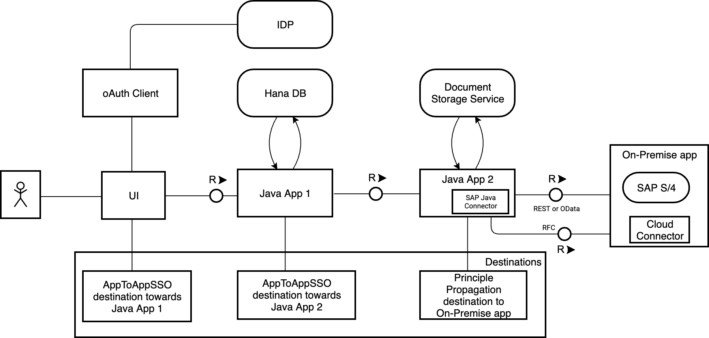

The first app manages Personnel entities in the HANA database. The second app stores files in the document service and provides a REST API for managing files and a user interface.<br>

The first app has a UI that creates a person with a first name, second name, and a photo. To store the photo, the first app uses a REST API of the second app to store the person's photo as a document. For that purpose, there must be "trust" between the two apps.<br>

Each app should be able to work alone - i.e. even if the document storage app is not there, the person app should be able to store a person without a photo, and the document app should be able to work alone.<br>

### Project Structure
**scenario/**<br>
|--**on-premise-demo** - sources of OnPremise demo application<br>
|--**neo/**<br>
&nbsp;&nbsp;&nbsp;|--**application1/** - sources of Java app 1 for SAP BTP Neo<br>
&nbsp;&nbsp;&nbsp;&nbsp;&nbsp;&nbsp;|-- ...<br>
&nbsp;&nbsp;&nbsp;|--**application2/** - sources of Java app 2 for SAP BTP Neo<br>
&nbsp;&nbsp;&nbsp;&nbsp;&nbsp;&nbsp;|-- ...<br>
|--**cf/**<br>
&nbsp;&nbsp;&nbsp;|--**cf-application1/** - sources of migrated Java app 1 for SAP BTP CloudFoundry<br>
&nbsp;&nbsp;&nbsp;&nbsp;&nbsp;&nbsp;|--**approuter/** - sources of approuter application<br>
&nbsp;&nbsp;&nbsp;&nbsp;&nbsp;&nbsp;&nbsp;&nbsp;&nbsp;|--**xs-app.json** - approuter configuration<br>
&nbsp;&nbsp;&nbsp;&nbsp;&nbsp;&nbsp;|--**mta.yaml** - deployment descriptor<br>
&nbsp;&nbsp;&nbsp;&nbsp;&nbsp;&nbsp;|--**xs-security.json** - security descriptor<br>
&nbsp;&nbsp;&nbsp;&nbsp;&nbsp;&nbsp;|-- ...<br>
&nbsp;&nbsp;&nbsp;|--**cf-application2/** - sources of migrated Java app 2 for SAP BTP CloudFoundry<br>
&nbsp;&nbsp;&nbsp;&nbsp;&nbsp;&nbsp;|--**approuter/** - sources of approuter application<br>
&nbsp;&nbsp;&nbsp;&nbsp;&nbsp;&nbsp;&nbsp;&nbsp;&nbsp;|--**xs-app.json** - approuter configuration<br>
&nbsp;&nbsp;&nbsp;&nbsp;&nbsp;&nbsp;|--**mta.yaml** - deployment descriptor<br>
&nbsp;&nbsp;&nbsp;&nbsp;&nbsp;&nbsp;|--**xs-security.json** - security descriptor<br>
&nbsp;&nbsp;&nbsp;&nbsp;&nbsp;&nbsp;|-- ...<br>

## SAP BTP Neo Deployment

### Option 1. Via SAP BTP Cockpit

To build and deploy this scenario in SAP BTP Neo, you need to do following:

1. Clone/download this repository.<br>
2. Go to the `scenario/neo` directory.<br>
3. Go to `application1` and execute the `mvn clean package` command from the terminal. Repeat the steps for `application2`.

4. Go to the SAP BTP Neo subaccount -> Java Applications. Choose `Deploy Application` and provide the location of the `*.war` file for each application.

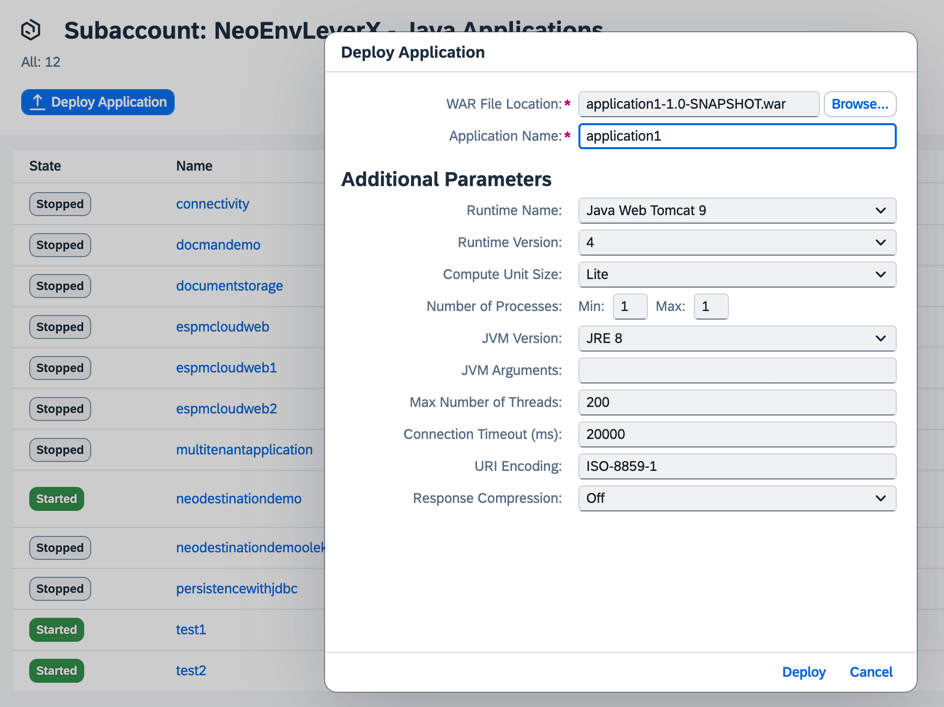

5. Choose `Deploy`.

> Note: please do not start the applications yet.

### Option 2. Via Neo CLI

1. Clone/download this repository.<br>
2. Go to the `scenario/neo` directory.<br>
3. Go to `application1` and execute the `mvn clean package` command from terminal. Repeat the steps for `application2`.

> Note: Install Neo CLI if not installed yet. [Installation](https://help.sap.com/docs/btp/sap-btp-neo-environment/install-sap-btp-sdk-for-neo-environment?locale=en-US)

4. Execute the following command for `application1` and `application2`:<br>
```shell
neo.sh deploy --account <subaccount technical name> --application <application name> --source <path to war file> --user <user name or email> --host <host>
```

> Note: Neo CLI provides `neo.sh` and `neo.bat` for UNIX systems and Windows respectively. You can find them in `<Neo CLI directory>/tools`.<br>
>
> Note: See [here](https://help.sap.com/docs/btp/sap-btp-neo-environment/regions-and-hosts-available-for-neo-environment) for the host for the subaccount<br>
>
> Note: Get the subaccount technical name from the SAP BTP Neo subaccount overview page:<br>
> 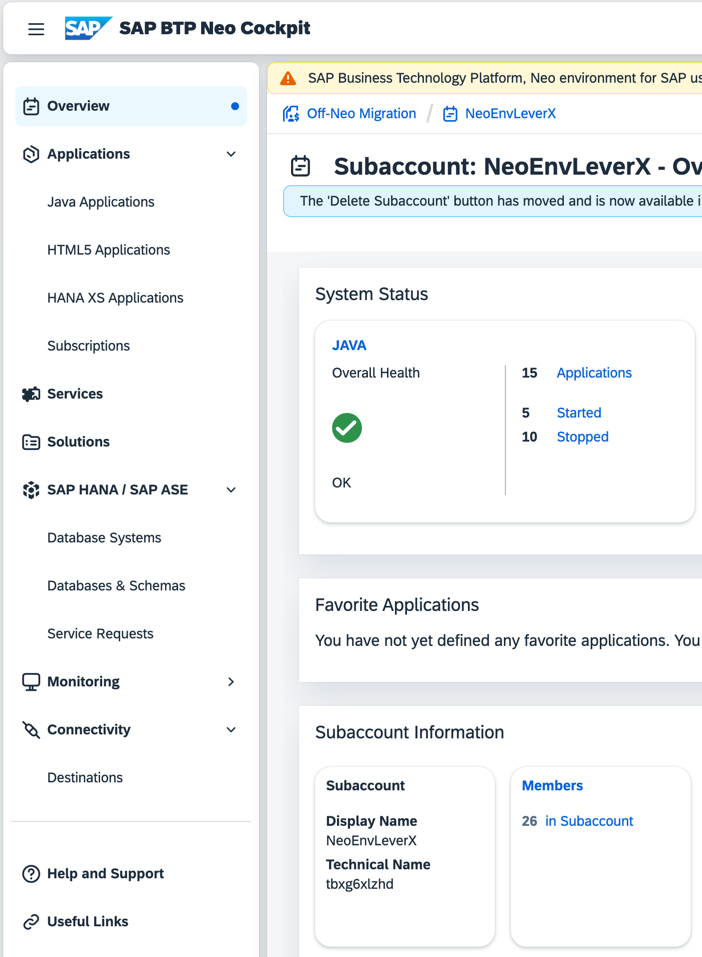


Useful links:
- [Using Neo CLI](https://help.sap.com/docs/btp/sap-btp-neo-environment/using-console-client)

#### SAP BTP Neo applications configuration

Go the SAP Hana Workbench and create a new user for the data source binding:
1. Go to `SAP HANA/SAP ASE`, choose `Databases & Schemas` and click on the database you have:<br>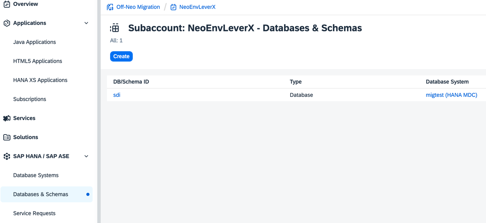<br>
2. Click `SAP HANA Web-Based Development Workbench`:<br>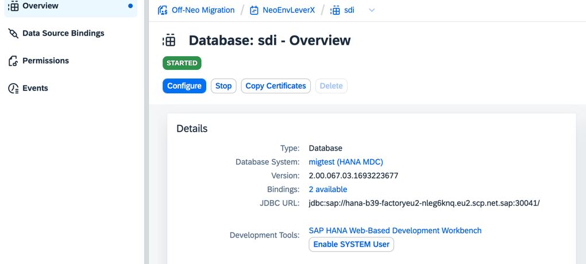<br>
3. Click on the `Catalog` tile.
4. Open a new SQL console and create a new user by executing the following SQL statement:
```sql
CREATE USER <username> PASSWORD <password> NO FORCE_FIRST_PASSWORD_CHANGE;
```
Example:<br>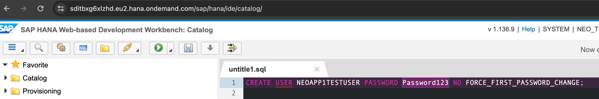

5. Go to the deployed **application1**.

6. Open the `Configuration` tab -> `Data Source Bindings` and provide the required details:
   - Data Source field: `jdbc/application1`
   - DB/Schema ID
   - Database User and password (the newly created user credentials).

7. Choose `Create`.

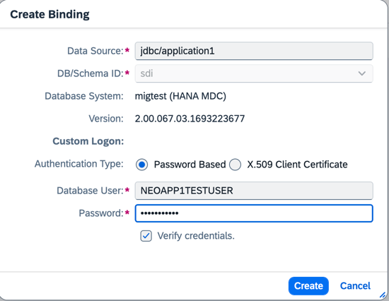

8. Go to the deployed **application2** and start it.

9. Go back to the deployed **application1** and open the `Configuration` tab -> `Destinations`.

10. Click `New Destination` and provide the required details:
- Name: application2-destination
- Type: HTTP
- URL: Enter the url of the started **application2**
- Proxy Type: Internet
- Authentication: AppToAppSSO

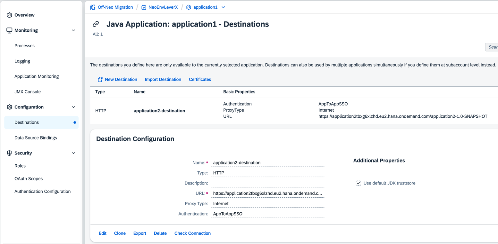

11. Start **application1**.


#### SAP BTP Neo UI Deployment

You can use a sample SAPUI5 application to trigger Java endpoints in a user-friendly environment.
Follow the steps below to deploy the SAPUI5 application to the SAP BTP Neo cockpit and connect it to the Java application.
1. Choose HTML5 Applications in the left navigation panel.
   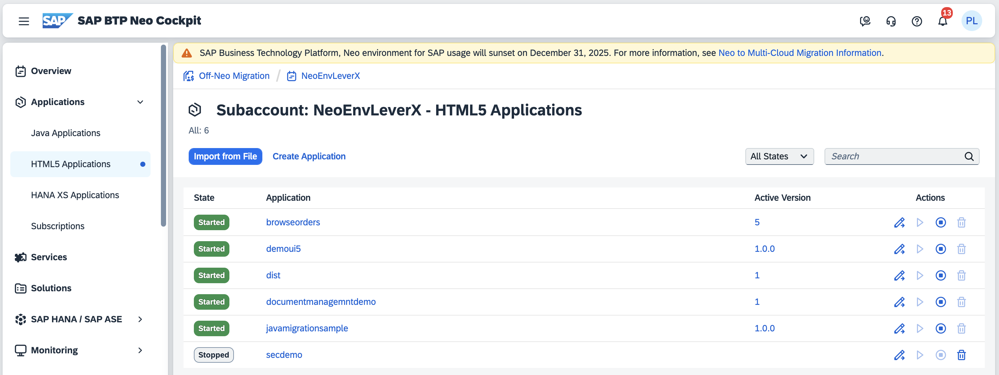

2. Choose "Import from file" to create an application and provide the required details:
- Download the [zip](./scenario/neo/employeelistui/dist.zip) file to your local machine and provide a path to the archive in the "Zip File" field.
- Application name
- Application version

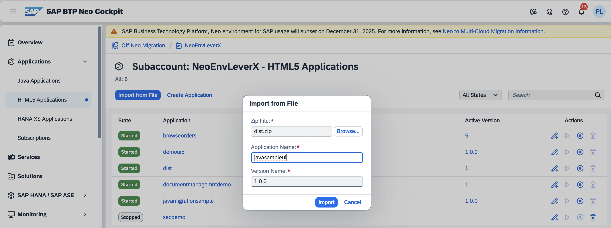

3. Select a new application in the list and open its details page.

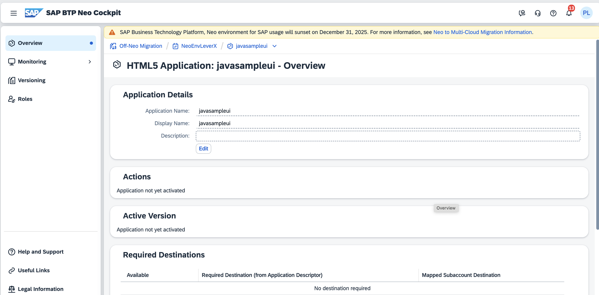

4. Choose "Versioning" -> "Versions" to activate a new version.

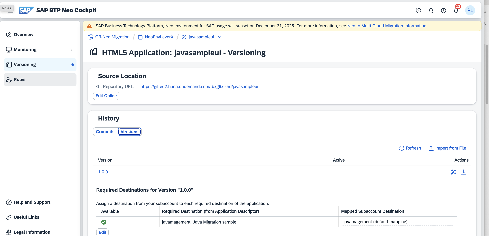

5. Choose "Activate version" and confirm the activation in a popup.

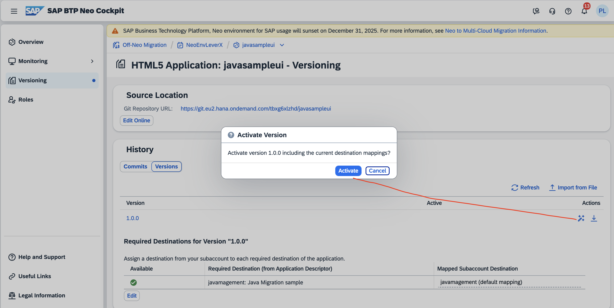

6. Go back to the app overview page. Verify that the application is started and copy the application link.

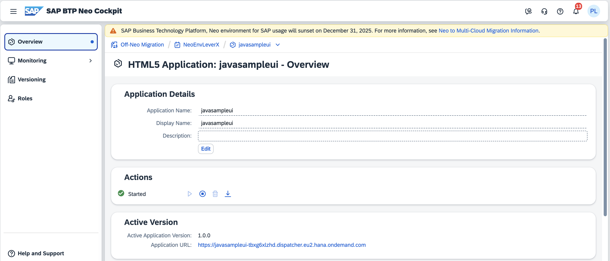

7. Go to Connectivity/Destinations and create a new destination to connect the SAPUI5 application to the Java application.
   - Name: javamagement
   - Type: HTTP
   - URL: Enter the url of the started **application1**
   - ProxyType: Internet
   - Authentication: AppToAppSSO

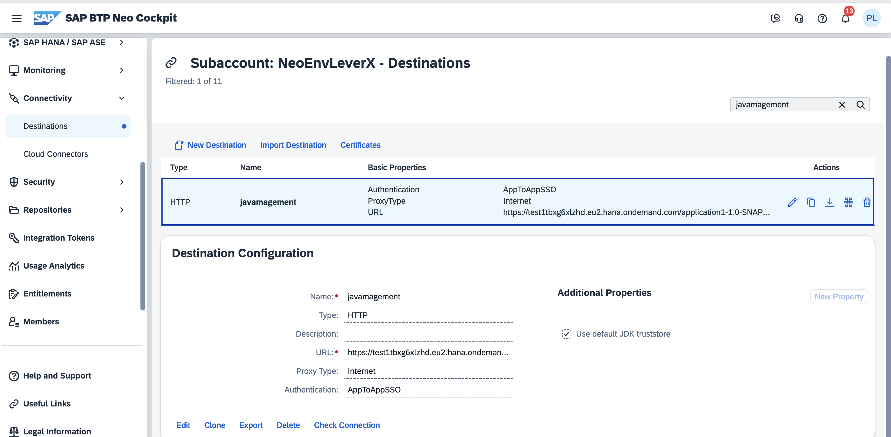

8. Open the SAPUI5 application using a link taken from the application overview page (see step 6).

## Migration

This is a guide on how to migrate scenario applications from SAP BTP Neo to SAP BTP Cloud Foundry. You can find already migrated applications in the `scenario/cf/` directory.

To try this migration yourself, copy the content in the `scenario/neo/` directory to another directory of your choice (e.g. `migration/`) and follow the next steps.

### Step 1. Neo Java Web API to SAP Cloud SDK
The Neo Java Web API dependency is not provided in Cloud Foundry. Comment out the following lines in `migration/application1/pom.xml` and `migration/application2/pom.xml`:<br>
:x:
```xml
<dependency>
    <groupId>com.sap.cloud</groupId>
    <artifactId>neo-java-web-api</artifactId>
    <version>${neo-java-web-api-version}</version>
    <scope>provided</scope>
</dependency>
```
You can use the SAP Cloud SDK to interact with services:<br>

:white_check_mark:
```xml
<dependencyManagement>
  <dependencies>
   <dependency>
      <groupId>com.sap.cloud.sjb.cf</groupId>
      <artifactId>cf-tomcat-bom</artifactId>
      <version>${cf-tomcat-bom-version}</version>
      <type>pom</type>
      <scope>import</scope>
   </dependency>
    <dependency>
        <groupId>com.sap.cloud.sdk</groupId>
        <artifactId>sdk-modules-bom</artifactId>
        <version>${sdk-modules-bom-version}</version>
        <type>pom</type>
        <scope>import</scope>
    </dependency>
  </dependencies>
</dependencyManagement>

<dependencies>
    <dependency>
        <groupId>com.sap.cloud.sdk.cloudplatform</groupId>
        <artifactId>scp-cf</artifactId>
    </dependency>
    ...
</dependencies>
```
```
<properties>
...
  <cf-tomcat-bom-version>Add version here</cf-tomcat-bom-version>
  <sdk-modules-bom-version>Add version hеrе</sdk-modules-bom-version>
...
</properties>
```
> Note: sdk-modules-bom - Bill of Materials (BOM) of the SAP Cloud SDK modules. For versions see [here](https://mvnrepository.com/artifact/com.sap.cloud.sdk/sdk-modules-bom). Note that v4.*.* and below are compatible with java 8.<br>
> Note: cf-tomcat-bom - Versions control of CF Tomcat BOM. For version see [here](https://mvnrepository.com/artifact/com.sap.cloud.sjb.cf/cf-tomcat-bom). Note that v1.*.* is compatible with java 8.<br>


As the Neo Java Web API is not provided in the SAP BTP Cloud Foundry environment, you need to **comment out** all Neo-related `<resource-ref>` from `migration/application1` and `migration/application2`.
They are located in `application1/src/webapp/WEB-INF/web.xml` and `application2/src/webapp/WEB-INF/web.xml`. The following are available:<br>
:x:
```xml
<resource-ref>
    <res-ref-name>jdbc/application1</res-ref-name>
    <res-type>javax.sql.DataSource</res-type>
</resource-ref>

<resource-ref>
    <res-ref-name>connectivityConfiguration</res-ref-name>
    <res-type>com.sap.core.connectivity.api.configuration.ConnectivityConfiguration</res-type>
</resource-ref>

<resource-ref>
    <res-ref-name>authenticationHeaderProvider</res-ref-name>
    <res-type>com.sap.core.connectivity.api.authentication.AuthenticationHeaderProvider</res-type>
</resource-ref>
```

Useful links:
- SAP Cloud SDK for Java - [documentation](https://sap.github.io/cloud-sdk/docs/java/overview-cloud-sdk-for-java)
- Bill Of Materials - [documentation](https://help.sap.com/docs/btp/sap-business-technology-platform/bill-of-materials-bom)

### Step 2. Approuter
If your application interacts with the user (e.g. use template engines or serves static files like *.html), you need to use approuter which will act as a gateway which will trigger authentication.<br>

Start by creating a new directory with the name `approuter` in the `migration/application1` and `migration/application2` directories. Create `package.json` and `xs-app.json` files inside the `approuter` directory. <br>

`package.json`:
```json
{
  "name": "approuter",
  "dependencies": {
    "@sap/approuter": "^16.0.0"
  },
  "scripts": {
    "start": "node node_modules/@sap/approuter/approuter.js"
  }
}
```
> Note: The version of the approuter can change. Please take this into account during actual migration. See  [NPM](https://www.npmjs.com/package/@sap/approuter).


`xs-app.json` for application1:
```json
{
  "authenticationMethod": "route",
  "routes": [
    {
      "source": "^(/.*)",
      "target": "$1",
      "destination": "cf-app1-destination",
      "authenticationType": "xsuaa",
      "csrfProtection": false
    }
  ]
}
```

`xs-app.json` for application2:
```json
{
  "authenticationMethod": "route",
  "routes": [
    {
      "source": "^(/.*)",
      "target": "$1",
      "destination": "cf-app2-destination",
      "authenticationType": "xsuaa",
      "csrfProtection": false
    }
  ]
}
```

> Note: Put your name of destination which will be used to proxy requests from approuter to the backend application. You can create this destination in SAP BTP Cockpit or create it with the deployment descriptor. The creation of a destination with the deployment descriptor is described in one of next steps.<br>
> See: [Application Router Configuration Syntax](https://help.sap.com/docs/hana-cloud-database/sap-hana-cloud-sap-hana-database-developer-guide-for-cloud-foundry-multitarget-applications-sap-web-ide-full-stack/application-router-configuration-syntax)

### Step 3. Authentication and authorization
SAP BTP Cloud Foundry uses the XSUAA service instance for authentication and authorization.<br>
To use it, you need to create a service instance and a service binding to your application.<br>

The creation of XSUAA service instance/service binding is done automatically by the `cf deploy` command with Deployment Artifact (Section [Step 7. Deployment](#step-7-deployment)).<br>
We need to create the `xs-security.json` file which is also known as Security Descriptor - configuration file for specifying scopes, role-templates, role-collection etc.

:white_check_mark:<br>
`migration/application1/xs-security.json`:
```json
{
   "xsappname": "cf-application1",
   "tenant-mode": "dedicated",
   "scopes": [
      {
         "name": "$XSAPPNAME.Everyone",
         "description": "Everyone"
      },
      {
         "name": "uaa.user",
         "description": "UAA"
      }
   ],
   "role-templates": [
      {
         "name": "Everyone",
         "scope-references": [
            "$XSAPPNAME.Everyone",
            "uaa.user"
         ]
      }
   ],
   "role-collections": [
      {
         "name": "Everyone_RC",
         "role-template-references": [
            "$XSAPPNAME.Everyone"
         ]
      }
   ]
}
```

:white_check_mark:<br>
`migration/application2/xs-security.json`:
```json
{
   "xsappname": "cf-application2",
   "tenant-mode": "dedicated",
   "scopes": [
      {
         "name": "$XSAPPNAME.Everyone",
         "description": "Everyone"
      }
   ],
   "role-templates": [
      {
         "name": "Everyone",
         "scope-references": [
            "$XSAPPNAME.Everyone"
         ]
      }
   ],
   "role-collections": [
      {
         "name": "Everyone_RC_app2",
         "role-template-references": [
            "$XSAPPNAME.Everyone"
         ]
      }
   ]
}
```


In the `src/main/webapp/WEB-INF/web.xml` of the `migration/application1` and `migration/application2` java application, you need to change `<auth-method>` to XSUAA:<br>
:white_check_mark:
```xml
<login-config>
    <auth-method>XSUAA</auth-method>
</login-config>
```

> Note: In SAP BTP Neo all authenticated users implicitly have the `Everyone` role, but that is not the case for SAP BTP Cloud Foundry.

In SAP BTP Neo applications, the `UserManagementAccessor` API was used to retrieve information about the current user. <br>
In SAP BTP Cloud Foundry, we will use [cloud-security-services-integration-library](https://github.com/SAP/cloud-security-services-integration-library/tree/main-2.x).
To do that, we need to add the following dependency to pom.xml (both for `migration/application1` and `migration/application2`):<br>

:white_check_mark:
```xml
<dependency>
    <groupId>com.sap.cloud.security</groupId>
    <artifactId>java-api</artifactId>
</dependency>
```

This is how the code that is responsible for user data retrieval needs to be modified: <br>
**`migration/application1/src/java/servlet/UserInfoServlet`**:<br>

> Note: Below the comparison block you can copy the already refacoted code from the toggle button:

```diff
package com.example.application1.servlet;

import com.example.application1.dto.UserDto;
import com.fasterxml.jackson.databind.ObjectMapper;
-import com.sap.security.um.service.UserManagementAccessor;
-import com.sap.security.um.user.User;
-import com.sap.security.um.user.UserProvider;
-import org.slf4j.Logger;
-import org.slf4j.LoggerFactory;
+import com.sap.cloud.security.token.SecurityContext;
+import com.sap.cloud.security.token.Token;
+import com.sap.cloud.security.token.TokenClaims;
import javax.servlet.ServletException;
import javax.servlet.http.HttpServlet;
import javax.servlet.http.HttpServletRequest;
import javax.servlet.http.HttpServletResponse;
+import java.io.IOException;

public class UserInfoServlet extends HttpServlet {

-  private final static Logger LOGGER = LoggerFactory.getLogger(UserInfoServlet.class);

  public void doGet(HttpServletRequest request, HttpServletResponse response) throws ServletException {
-    if (request.getUserPrincipal() == null) {
-      throw new ServletException("User principal is null");
-   }
+   Token token = SecurityContext.getAccessToken();

+    if (token == null) {
+      throw new ServletException("Access token is null");
+    }

-    try {
-      // UserProvider provides access to the user storage
-      UserProvider users = UserManagementAccessor.getUserProvider();
-
-      // Read the currently logged-in user from the user storage
-      User user = users.getUser(request.getUserPrincipal().getName());
-
-      String username = user.getAttribute("firstname") + " " + user.getAttribute("lastname");

+     String userНame = token.getClaimAsString(TokenClaims.GIVEN_NAME);
+    String email = token.getClaimAsString(TokenClaims.EMAIL);   
-      String email = user.getAttribute("email");

      UserDto userDto = new UserDto(userНame, email);
      String userDtoJson = new ObjectMapper().writeValueAsString(userDto);
      response.getWriter().print(userDtoJson);
-    } catch (Exception e) {
-      LOGGER.error("Exception occurred: " + e.getMessage(), e);
-
-      throw new ServletException(e);
-    }
}

```

<details>
<summary>Click here to copy the full refactored code for UserInfoServlet</summary>

```java
package com.example.application1.servlet;

import com.example.application1.dto.UserDto;
import com.fasterxml.jackson.databind.ObjectMapper;
import com.sap.cloud.security.token.SecurityContext;
import com.sap.cloud.security.token.Token;
import com.sap.cloud.security.token.TokenClaims;

import javax.servlet.ServletException;
import javax.servlet.http.HttpServlet;
import javax.servlet.http.HttpServletRequest;
import javax.servlet.http.HttpServletResponse;
import java.io.IOException;

public class UserInfoServlet extends HttpServlet {

  public void doGet(HttpServletRequest request, HttpServletResponse response) throws IOException, ServletException {
    Token token = SecurityContext.getAccessToken();

    if (token == null) {
      throw new ServletException("Access token is null");
    }

    String userName = token.getClaimAsString(TokenClaims.GIVEN_NAME);
    String email = token.getClaimAsString(TokenClaims.EMAIL);

    UserDto userDto = new UserDto(userName, email);

    String userDtoJson = new ObjectMapper().writeValueAsString(userDto);

    // Print the username and email
    response.getWriter().print(userDtoJson);
  }

}
```
</details>

You can copy the following classes which have been refactored as shown above:

<details>
<summary>HomeServlet class in migration/application2</summary>
The path of the old Neo code: scenario/neo/application2/src/java

```java
package com.example.application2;

import com.sap.cloud.security.token.SecurityContext;
import com.sap.cloud.security.token.Token;
import com.sap.cloud.security.token.TokenClaims;

import javax.servlet.ServletException;
import javax.servlet.http.HttpServlet;
import javax.servlet.http.HttpServletRequest;
import javax.servlet.http.HttpServletResponse;
import java.io.IOException;

public class HomeServlet extends HttpServlet {

  public void doGet(HttpServletRequest request, HttpServletResponse response) throws IOException, ServletException {
    Token token = SecurityContext.getAccessToken();

    if (token == null) {
      request.setAttribute("message", "Access token is null");
      request.getRequestDispatcher("/error.jsp").forward(request, response);
      return;
    }

    String userName = token.getClaimAsString(TokenClaims.USER_NAME);
    String email = token.getClaimAsString(TokenClaims.EMAIL);

    // Print the username and email
    request.setAttribute("username", userName);
    request.setAttribute("email", email);

    request.getRequestDispatcher("/home.jsp").forward(request, response);
  }

}
```
</details>


Useful links:
- Application Security Descriptor Configuration Syntax - [documentation](https://help.sap.com/docs/btp/sap-business-technology-platform/application-security-descriptor-configuration-syntax)
- SAP BTP Neo Get User Attributes - [documentation](https://help.sap.com/docs/btp/sap-btp-neo-environment/user-attributes)

### Step 4. Destinations
SAP BTP Neo application used ConnectivityConfiguration and AuthenticationHeaderProvider APIs. They should be **already commented out** from `migration/application1/src/main/webapp/WEB-INF/web.xml` and `migration/application2/src/main/webapp/WEB-INF/web.xml` as shown in [Step 1](#step-1-neo-java-web-api-to-sap-cloud-sdk).<br>

SAP BTP Neo and CF Code difference for destination usage in `application1`. For SAP BTP Cloud Foundry, the SAP Cloud SDK provides an API to consume destinations created in the SAP BTP Cockpit.<br>

> Note: Below the comparison block you can copy the already refacoted code from the toggle button
```diff
package com.example.application1.servlet;

import com.example.application1.dao.PersonDAO;
import com.example.application1.model.Person;
import com.fasterxml.jackson.databind.ObjectMapper;
-import com.sap.core.connectivity.api.authentication.AuthenticationHeader;
-import com.sap.core.connectivity.api.authentication.AuthenticationHeaderProvider;
-import com.sap.core.connectivity.api.configuration.ConnectivityConfiguration;
-import com.sap.core.connectivity.api.configuration.DestinationConfiguration;
+import com.sap.cloud.sdk.cloudplatform.connectivity.HttpDestination;
+import com.sap.cloud.sdk.cloudplatform.connectivity.exception.DestinationNotFoundException;
import org.apache.http.HttpEntity;
+import org.apache.http.client.HttpClient;
import org.apache.http.client.methods.HttpPost;
import org.apache.http.client.utils.URIBuilder;
import org.apache.http.entity.mime.MultipartEntityBuilder;
import org.apache.http.impl.client.BasicResponseHandler;
-import org.apache.http.impl.client.CloseableHttpClient;
-import org.apache.http.impl.client.HttpClients;
import org.slf4j.Logger;
import org.slf4j.LoggerFactory;

-import javax.naming.InitialContext;
-import javax.naming.NamingException;
import javax.servlet.ServletException;
import javax.servlet.annotation.MultipartConfig;
import javax.servlet.http.HttpServlet;
import javax.servlet.http.HttpServletRequest;
import javax.servlet.http.HttpServletResponse;
import javax.servlet.http.Part;
import java.io.IOException;
import java.net.URI;
import java.net.URISyntaxException;
import java.util.List;

+import static com.sap.cloud.sdk.cloudplatform.connectivity.DestinationAccessor.getDestination;
+import static com.sap.cloud.sdk.cloudplatform.connectivity.HttpClientAccessor.getHttpClient;

@MultipartConfig
public class ManagementPageServlet extends HttpServlet {

  private final static Logger LOGGER = LoggerFactory.getLogger(ManagementPageServlet.class);

  private final static String DESTINATION_NAME = "application2-destination";

-  private ConnectivityConfiguration connectivityConfiguration;
-  private AuthenticationHeaderProvider authenticationHeaderProvider;
-
-  @Override
-  public void init() throws ServletException {
-    try {
-      InitialContext ctx = new InitialContext();
-
-      connectivityConfiguration = (ConnectivityConfiguration) ctx.lookup("java:comp/env/connectivityConfiguration");
-      authenticationHeaderProvider = (AuthenticationHeaderProvider) ctx.lookup("java:comp/env/authenticationHeaderProvider");
-    } catch (NamingException e) {
-      throw new ServletException("Can't lookup resources", e);
-    }
-  }
-
  public void doGet(HttpServletRequest request, HttpServletResponse response) throws IOException {
    PersonDAO personDAO = new PersonDAO();
    List<Person> personnel = personDAO.findAll();

    String personnelJson = new ObjectMapper().writeValueAsString(personnel);
    response.getWriter().print(personnelJson);
  }

  @Override
  protected void doPost(HttpServletRequest request, HttpServletResponse response) throws ServletException, IOException {
    String action = request.getParameter("action");

    if ("delete".equals(action)) {
      doDelete(request, response);
      return;
    }
    String fname = request.getParameter("fname");
    String lname = request.getParameter("lname");

    Person person = new Person();
    person.setFirstName(fname);
    person.setLastName(lname);

    Part file = request.getPart("file");

    if (file.getSize() > 0) {
-      DestinationConfiguration destinationConfiguration = connectivityConfiguration.getConfiguration(DESTINATION_NAME);
-      if (destinationConfiguration == null) {
+        HttpDestination httpDestination;
+      try {
+        httpDestination = getDestination(DESTINATION_NAME).asHttp();
+      } catch (DestinationNotFoundException e) {
        String message = "Destination to application2 not found.";
        LOGGER.error(message);

        throw new ServletException(message);
      }

-      String requestUrl = destinationConfiguration.getProperty("URL") + "/api/documents";
+     String requestUrl = httpDestination.getUri() + "/api/documents";
      AuthenticationHeader appToAppSSOHeader = authenticationHeaderProvider.getApptoAppSSOHeader(requestUrl, destinationConfiguration);

-      try (CloseableHttpClient httpClient = HttpClients.createDefault()) {
+     try {
+       HttpClient httpClient = getHttpClient(httpDestination);
        URIBuilder builder = new URIBuilder(requestUrl);
        builder.setParameter("caller", "external");
        builder.setParameter("fileName", file.getSubmittedFileName());
        URI uri = builder.build();

        HttpPost httpPost = new HttpPost(uri);
-        httpPost.addHeader(appToAppSSOHeader.getName(), appToAppSSOHeader.getValue());

        HttpEntity httpEntity = MultipartEntityBuilder.create().addBinaryBody("file", file.getInputStream()).build();

        httpPost.setEntity(httpEntity);

        String documentId = httpClient.execute(httpPost, new BasicResponseHandler()).replaceAll("^\"|\\n$", "");
        person.setImageId(documentId);
      } catch (IOException e) {
        LOGGER.error("Can't establish connection with Document Storage application: " + e.getMessage(), e);
      } catch (URISyntaxException e) {
        LOGGER.error("Exception occurred: " + e.getMessage(), e);

        throw new ServletException(e);
      }
    }

    PersonDAO personDAO = new PersonDAO();
    personDAO.save(person);
  }

  @Override
-  protected void doDelete(HttpServletRequest request, HttpServletResponse response) throws ServletException {
+  protected void doDelete(HttpServletRequest request, HttpServletResponse response) throws ServletException, IOException {
    String personId = request.getParameter("personId");
    long id = Long.parseLong(personId);
    PersonDAO personDAO = new PersonDAO();

    Person person = personDAO.findById(id);
    String imageId = person.getImageId();

    if (imageId != null) {
-      DestinationConfiguration destinationConfiguration = connectivityConfiguration.getConfiguration(DESTINATION_NAME);
-      if (destinationConfiguration == null) {
+     HttpDestination httpDestination;
+     try {
+       httpDestination = getDestination(DESTINATION_NAME).asHttp();
+     } catch (DestinationNotFoundException e) {
        String message = "Destination to application2 not found.";
        LOGGER.error(message);

        throw new ServletException(message);
      }

-     String requestUrl = destinationConfiguration.getProperty("URL") + "/api/documents";
+     String requestUrl = httpDestination.getUri() + "/api/documents";
-     AuthenticationHeader appToAppSSOHeader = authenticationHeaderProvider.getApptoAppSSOHeader(requestUrl, destinationConfiguration);

-     try (CloseableHttpClient httpClient = HttpClients.createDefault())
+     try
      {
+       HttpClient httpClient = getHttpClient(httpDestination);
        URIBuilder builder = new URIBuilder(requestUrl);
        builder.setParameter("action", "delete");
        builder.setParameter("caller", "external");
        builder.setParameter("documentId", imageId);
        URI uri = builder.build();

        HttpPost httpPost = new HttpPost(uri);
-       httpPost.addHeader(appToAppSSOHeader.getName(), appToAppSSOHeader.getValue());

-       httpClient.execute(httpPost, new BasicResponseHandler());
+       httpClient.execute(httpPost);
      } catch (IOException e) {
        LOGGER.error("Can't establish connection with Document Storage application: " + e.getMessage(), e);
      } catch (URISyntaxException e) {
        LOGGER.error("Exception occurred: " + e.getMessage(), e);

        throw new ServletException(e);
      }
    }

    personDAO.delete(id);
  }
}
```
<details>
<summary>ManagementPageServlet refactored code</summary>

```java
package com.example.application1.servlet;

import com.example.application1.dao.PersonDAO;
import com.example.application1.model.Person;
import com.fasterxml.jackson.databind.ObjectMapper;
import com.sap.cloud.sdk.cloudplatform.connectivity.HttpDestination;
import com.sap.cloud.sdk.cloudplatform.connectivity.exception.DestinationNotFoundException;
import org.apache.http.HttpEntity;
import org.apache.http.client.HttpClient;
import org.apache.http.client.methods.HttpPost;
import org.apache.http.client.utils.URIBuilder;
import org.apache.http.entity.mime.MultipartEntityBuilder;
import org.apache.http.impl.client.BasicResponseHandler;
import org.slf4j.Logger;
import org.slf4j.LoggerFactory;

import javax.servlet.ServletException;
import javax.servlet.annotation.MultipartConfig;
import javax.servlet.http.HttpServlet;
import javax.servlet.http.HttpServletRequest;
import javax.servlet.http.HttpServletResponse;
import javax.servlet.http.Part;
import java.io.IOException;
import java.net.URI;
import java.net.URISyntaxException;
import java.util.List;

import static com.sap.cloud.sdk.cloudplatform.connectivity.DestinationAccessor.getDestination;
import static com.sap.cloud.sdk.cloudplatform.connectivity.HttpClientAccessor.getHttpClient;

@MultipartConfig
public class ManagementPageServlet extends HttpServlet {

  private final static Logger LOGGER = LoggerFactory.getLogger(ManagementPageServlet.class);

  private final static String DESTINATION_NAME = "application2-destination";

  public void doGet(HttpServletRequest request, HttpServletResponse response) throws IOException, ServletException {
    PersonDAO personDAO = new PersonDAO();
    List<Person> personnel = personDAO.findAll();

    String personnelJson = new ObjectMapper().writeValueAsString(personnel);
    response.getWriter().print(personnelJson);

  }

  @Override
  protected void doPost(HttpServletRequest request, HttpServletResponse response) throws ServletException, IOException {
    String action = request.getParameter("action");

    if ("delete".equals(action)) {
      doDelete(request, response);
      return;
    }
    String fname = request.getParameter("fname");
    String lname = request.getParameter("lname");

    Person person = new Person();
    person.setFirstName(fname);
    person.setLastName(lname);

    Part file = request.getPart("file");

    if (file.getSize() > 0) {
      HttpDestination httpDestination;
      try {
        httpDestination = getDestination(DESTINATION_NAME).asHttp();
      } catch (DestinationNotFoundException e) {
        String message = "Destination to application2 not found.";
        LOGGER.error(message);

        throw new ServletException(message);
      }


      String requestUrl = httpDestination.getUri() + "/api/documents";

      try {
        HttpClient httpClient = getHttpClient(httpDestination);

        URIBuilder builder = new URIBuilder(requestUrl);
        builder.setParameter("caller", "external");
        builder.setParameter("fileName", file.getSubmittedFileName());
        URI uri = builder.build();

        HttpPost httpPost = new HttpPost(uri);

        HttpEntity httpEntity = MultipartEntityBuilder.create().addBinaryBody("file", file.getInputStream()).build();

        httpPost.setEntity(httpEntity);

        String documentId = httpClient.execute(httpPost, new BasicResponseHandler()).replaceAll("^\"|\\n$", "");
        person.setImageId(documentId);
      } catch (IOException e) {
        LOGGER.error("Can't establish connection with Document Storage application: " + e.getMessage(), e);
      } catch (URISyntaxException e) {
        LOGGER.error("Exception occurred: " + e.getMessage(), e);

        throw new ServletException(e);
      }
    }

    PersonDAO personDAO = new PersonDAO();
    personDAO.save(person);
  }

  @Override
  protected void doDelete(HttpServletRequest request, HttpServletResponse response) throws ServletException, IOException {
    String personId = request.getParameter("personId");
    long id = Long.parseLong(personId);
    PersonDAO personDAO = new PersonDAO();

    Person person = personDAO.findById(id);
    String imageId = person.getImageId();

    if (imageId != null) {
      HttpDestination httpDestination;
      try {
        httpDestination = getDestination(DESTINATION_NAME).asHttp();
      } catch (DestinationNotFoundException e) {
        String message = "Destination to application2 not found.";
        LOGGER.error(message);

        throw new ServletException(message);
      }

      String requestUrl = httpDestination.getUri() + "/api/documents";

      try {
        HttpClient httpClient = getHttpClient(httpDestination);

        URIBuilder builder = new URIBuilder(requestUrl);
        builder.setParameter("action", "delete");
        builder.setParameter("caller", "external");
        builder.setParameter("documentId", imageId);
        URI uri = builder.build();

        HttpPost httpPost = new HttpPost(uri);

        httpClient.execute(httpPost);
      } catch (IOException e) {
        LOGGER.error("Can't establish connection with Document Storage application: " + e.getMessage(), e);
      } catch (URISyntaxException e) {
        LOGGER.error("Exception occurred: " + e.getMessage(), e);

        throw new ServletException(e);
      }
    }

    personDAO.delete(id);
  }
}
```
</details>

Copy the classes that have been refactored as shown below:

<details>
<summary>ImageServlet class refactored code</summary>

```java
package com.example.application1.servlet;

import com.sap.cloud.sdk.cloudplatform.connectivity.HttpDestination;
import com.sap.cloud.sdk.cloudplatform.connectivity.exception.DestinationNotFoundException;
import org.apache.http.HttpResponse;
import org.apache.http.client.HttpClient;
import org.apache.http.client.methods.HttpGet;
import org.apache.http.client.utils.URIBuilder;
import org.slf4j.Logger;
import org.slf4j.LoggerFactory;

import javax.servlet.ServletException;
import javax.servlet.ServletOutputStream;
import javax.servlet.http.HttpServlet;
import javax.servlet.http.HttpServletRequest;
import javax.servlet.http.HttpServletResponse;
import java.io.BufferedInputStream;
import java.io.BufferedOutputStream;
import java.io.IOException;
import java.io.InputStream;
import java.io.OutputStream;
import java.net.URISyntaxException;

import static com.sap.cloud.sdk.cloudplatform.connectivity.DestinationAccessor.getDestination;
import static com.sap.cloud.sdk.cloudplatform.connectivity.HttpClientAccessor.getHttpClient;

public class ImageServlet extends HttpServlet {

  private final static Logger LOGGER = LoggerFactory.getLogger(ImageServlet.class);

  private final static String DESTINATION_NAME = "application2-destination";

  @Override
  protected void doGet(HttpServletRequest request, HttpServletResponse response) throws ServletException, IOException {

    String documentId = request.getParameter("documentId");

    HttpDestination httpDestination;
    try {
      httpDestination = getDestination(DESTINATION_NAME).asHttp();
    } catch (DestinationNotFoundException e) {
      String message = "Destination to application2 not found.";
      LOGGER.error(message);

      throw new ServletException(message);
    }

    String requestUrl = httpDestination.getUri() + "/api/documents";

    try {
      HttpClient httpClient = getHttpClient(httpDestination);

      URIBuilder builder = new URIBuilder(requestUrl);
      builder.setParameter("documentId", documentId);

      HttpGet httpGet = new HttpGet(builder.build());
      HttpResponse httpResponse = httpClient.execute(httpGet);

      InputStream inputStream = httpResponse.getEntity().getContent();
      ServletOutputStream outputStream = response.getOutputStream();

      copyContent(inputStream, outputStream);
    } catch (URISyntaxException e) {
      throw new ServletException(e);
    }

  }

  private void copyContent(InputStream is, OutputStream os) throws ServletException {
    try (BufferedInputStream bis = new BufferedInputStream(is); BufferedOutputStream bos = new BufferedOutputStream(os)) {
      byte[] buffer = new byte[1024];
      int count;
      while ((count = bis.read(buffer)) >= 0) {
        bos.write(buffer, 0, count);
      }
    } catch (IOException e) {
      throw new ServletException("Can't copy stream", e);
    }
  }
}
```
</details>

> Note: Simple and efficient example on how to migrate destinations from SAP BTP Neo to SAP BTP Cloud Foundry:
> - [SAP BTP Neo Destinations Migration Sample](https://github.com/SAP-samples/btp-destination-service-samples)

### Step 5. Connectivity

For SAP BTP Cloud Foundry, we can use the SAP Cloud SDK to establish a connection to an OnPremise system with SAP Cloud Connector. The SAP Cloud SDK provides an API to consume destinations created in the SAP BTP Cockpit.<br>

The SAP BTP Neo application uses ConnectivityConfiguration and AuthenticationHeaderProvider APIs. They should be **already commented out** from `migration/application2/src/main/webapp/WEB-INF/web.xml` as shown in [Step 1](#step-1-neo-java-web-api-to-sap-cloud-sdk).<br>

#### Refactor SAP BTP Neo Code for connectivity usage

This is how we can refactor SAP BTP Neo Code for connectivity usage.<br>

> Note: Below the comparison block you can copy the already refactored code from the toggle button

```diff
public class OnPremiseServlet extends HttpServlet {

  private final static Logger LOGGER = LoggerFactory.getLogger(OnPremiseServlet.class);

  private final static String DESTINATION_NAME = "on-premise-dest";

-  @Resource
-  private TenantContext tenantContext;
-
-  private ConnectivityConfiguration connectivityConfiguration;
-
-  @Override
-  public void init() {
-    try {
-      InitialContext ctx = new InitialContext();
-
-      connectivityConfiguration = (ConnectivityConfiguration) ctx.lookup("java:comp/env/connectivityConfiguration");
-    } catch (NamingException e) {
-      throw new RuntimeException("Can't lookup resources", e);
-    }
-  }

  @Override
  protected void doGet(HttpServletRequest request, HttpServletResponse response) throws ServletException, IOException {
    String message;
    try {
-      DestinationConfiguration destinationConfiguration = connectivityConfiguration.getConfiguration(DESTINATION_NAME);
+     HttpDestination httpDestination = getDestination(DESTINATION_NAME).asHttp();
-     String requestUrl = destinationConfiguration.getProperty("URL") + "/hello-servlet";
+     String requestUrl = httpDestination.getUri() + "/hello-servlet";

-      String proxyHost = System.getenv("HC_OP_HTTP_PROXY_HOST");
-      int proxyPort = Integer.parseInt(System.getenv("HC_OP_HTTP_PROXY_PORT"));
-
-      Proxy proxy = new Proxy(Proxy.Type.HTTP, new InetSocketAddress(proxyHost, proxyPort));
-
-      URL url = new URL(requestUrl);
-      HttpURLConnection urlConnection = (HttpURLConnection) url.openConnection(proxy);
-      urlConnection.setRequestProperty("SAP-Connectivity-ConsumerAccount", tenantContext.getTenant().getAccount().getName());
-
-      try (InputStream inputStream = urlConnection.getInputStream()) {
-        message = new BufferedReader(new InputStreamReader(inputStream, StandardCharsets.UTF_8)).lines().collect(Collectors.joining("\n"));
-      }
+     HttpClient httpClient = getHttpClient(httpDestination);
+     HttpGet httpGet = new HttpGet(requestUrl);
+     message = httpClient.execute(httpGet, new BasicResponseHandler());
    } catch (Exception e) {
      LOGGER.error("Can't establish connection to OnPremise system", e);

      message = "Can't establish connection to OnPremise system: " + e.getMessage();
    }

    request.setAttribute("message", message);
    request.getRequestDispatcher("/on-premise.jsp").forward(request, response);
  }
}
```

<details>
<summary>OnPremiseServlet refactored code</summary>

```java
package com.example.application2;

import com.sap.cloud.sdk.cloudplatform.connectivity.HttpDestination;
import org.apache.http.client.HttpClient;
import org.apache.http.client.methods.HttpGet;
import org.apache.http.impl.client.BasicResponseHandler;
import org.slf4j.Logger;
import org.slf4j.LoggerFactory;

import javax.servlet.ServletException;
import javax.servlet.http.HttpServlet;
import javax.servlet.http.HttpServletRequest;
import javax.servlet.http.HttpServletResponse;
import java.io.IOException;

import static com.sap.cloud.sdk.cloudplatform.connectivity.DestinationAccessor.getDestination;
import static com.sap.cloud.sdk.cloudplatform.connectivity.HttpClientAccessor.getHttpClient;

public class OnPremiseServlet extends HttpServlet {

  private final static Logger LOGGER = LoggerFactory.getLogger(OnPremiseServlet.class);

  private final static String DESTINATION_NAME = "on-premise-dest";

  @Override
  protected void doGet(HttpServletRequest request, HttpServletResponse response) throws ServletException, IOException {
    String message;
    try {
      HttpDestination httpDestination = getDestination(DESTINATION_NAME).asHttp();
      String requestUrl = httpDestination.getUri() + "/hello-servlet";

      HttpClient httpClient = getHttpClient(httpDestination);
      HttpGet httpGet = new HttpGet(requestUrl);

      message = httpClient.execute(httpGet, new BasicResponseHandler());
    } catch (Exception e) {
      LOGGER.error("Can't establish connection to OnPremise system", e);

      message = "Can't establish connection to OnPremise system: " + e.getMessage();
    }

    request.setAttribute("message", message);

    request.getRequestDispatcher("/on-premise.jsp").forward(request, response);
  }
}
```
</details>

SAP Cloud SDK connectivity [documentation](https://sap.github.io/cloud-sdk/docs/java/features/connectivity/on-premise)<br>

#### Run OnPremise demo application

##### SAP Cloud Connector setup:

- Download the appropriate version of SAP Cloud connector for your machine from the [SAP Development Tools](https://tools.hana.ondemand.com/#cloud) -> Cloud page.
- Extract the downloaded zip and run the `./go.sh` script.
- There would be a link in the console after you start the SCC from which you can access it from the browser.
- The default credentials are:
   - `Administrator` for the username
   - `manage` for the password
- After you login make sure to connect the SAP Cloud Connector to your SAP BTP subaccount.
   - `Add subaccount -> Configure manually -> Enter subaccount data -> Finish`
- In the 'Cloud to On-premise' tab create a virtual mapping to your local application and create a `resource` with path `'/'` and select `Path And All Sub-Paths`
  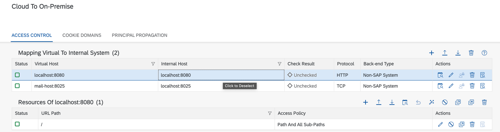<br>

##### Run on-premise-demo app:

- Option 1. Import it into your IDE and run with tomcat here.
- Option 2. Deploy right into tomcat by copying the `*.war` file into the `webapps` directory.
> Note: For option 2 to start the on-premise-app simply run the following command from the tomcat folder: `./bin/startup.sh`
- Option 3. Use docker to build and run the application in a container.

Build the application with maven:
```
mvn clean package
```
Create the following `Dockerfile` in the scenario/on-premise-demo folder:
```Dockerfile
FROM tomcat:9.0.89-jdk8
COPY target/*.war $CATALINA_HOME/webapps/
EXPOSE 8080
CMD ["catalina.sh","run"]
```
Build the docker image with the following command:
```
docker build -t tomcat-docker .
```
Run the docker image with the following command:
```
docker run -p 8080:8080 tomcat-docker
```

> Note: You can add the `-d` flag to run the docker image in detached mode

You can checkout the on-premise app on the following URL: `http://localhost:8080/on-premise-demo-1.0-SNAPSHOT/hello-servlet`

**BTP Cockpit -> Cloud Foundry -> Connectivity -> Destination**

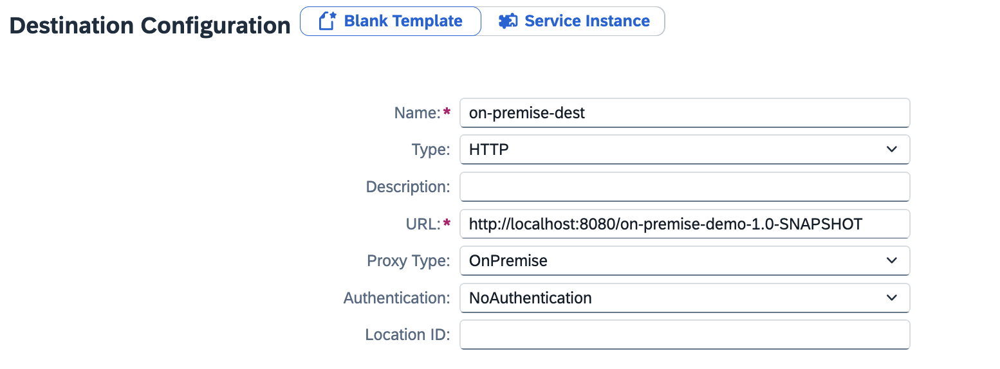<br>

### Step 6. Document Management Service

**Comment out** the following lines from `migration/application2/src/main/webapp/WEB-INF/web.xml`:<br>
:x:
```xml
<resource-ref>
    <res-ref-name>EcmService</res-ref-name>
    <res-type>com.sap.ecm.api.EcmService</res-type>
</resource-ref>
```

For SAP BTP Cloud Foundry, we need to add the following dependencies to `migration/application2/pom.xml`.<br>
:white_check_mark:
```xml
<dependency>
    <groupId>org.apache.chemistry.opencmis</groupId>
    <artifactId>chemistry-opencmis-client-impl</artifactId>
    <version>1.1.0</version>
</dependency>

<dependency>
    <groupId>org.apache.chemistry.opencmis</groupId>
    <artifactId>chemistry-opencmis-client-api</artifactId>
    <version>1.1.0</version>
</dependency>
```

For SAP BTP Cloud Foundry, the main difference is in **retrieval of opencmis session.**<br>
SAP BTP Neo opencmis session retrieval:<br>

> Note: Below the comparison block you can copy the already refacoted code from the toggle button

```diff
package com.example.application2.ecm;

+import com.fasterxml.jackson.core.JsonProcessingException;
+import com.fasterxml.jackson.core.type.TypeReference;
+import com.fasterxml.jackson.databind.JsonNode;
+import com.fasterxml.jackson.databind.ObjectMapper;
+import com.fasterxml.jackson.databind.node.ObjectNode;
-import com.sap.ecm.api.EcmService;
-import com.sap.ecm.api.RepositoryOptions;
import org.apache.chemistry.opencmis.client.api.Session;
-import org.apache.chemistry.opencmis.commons.exceptions.CmisObjectNotFoundException;
+import org.apache.chemistry.opencmis.client.api.SessionFactory;
+import org.apache.chemistry.opencmis.client.runtime.SessionFactoryImpl;
+import org.apache.chemistry.opencmis.commons.SessionParameter;
+import org.apache.chemistry.opencmis.commons.exceptions.CmisUnauthorizedException;
+import org.apache.http.HttpHeaders;
+import org.apache.http.HttpResponse;
+import org.apache.http.client.methods.HttpGet;
+import org.apache.http.client.methods.HttpPost;
+import org.apache.http.entity.StringEntity;
+import org.apache.http.impl.client.CloseableHttpClient;
+import org.apache.http.impl.client.HttpClientBuilder;

+import java.io.BufferedReader;
+import java.io.IOException;
+import java.io.InputStreamReader;
+import java.nio.charset.StandardCharsets;
+import java.util.Base64;
+import java.util.HashMap;
+import java.util.Map;
+import java.util.Optional;

-import javax.naming.InitialContext;
-import javax.naming.NamingException;

public class EcmManager {
- private final static String UNIQUE_NAME = "test_repository";
- private final static String SECRET_KEY = "test_repository_secret_key";

+ // CMIS Session parameter values
+ private final static String BROWSER = "browser";
+ private final static String TRUE = "true";
+ private final static String FALSE = "false";
+ private final static String LANGUAGE_EN = "en";
+ private final static String CONNECTION_TIMEOUT = Integer.toString(30_000);
+ private final static String READ_TIMEOUT = Integer.toString(600_000);

+ // VCAP Services environment nodes
+ private final static String VCAP_SERVICES = "VCAP_SERVICES";
+ private final static String SDM = "sdm";
+ private final static String CREDENTIALS = "credentials";
+ private final static String ENDPOINTS = "endpoints";
+ private final static String ECM_SERVICE = "ecmservice";
+ private final static String URL = "url";
+ private final static String UAA = "uaa";
+ private final static String ACCESS_TOKEN = "access_token";
+ private final static String TOKEN_ENDPOINT = "/oauth/token";
+ private final static String CLIENT_ID = "clientid";
+ private final static String CLIENT_SECRET = "clientsecret";
+ private final static String AUTHORIZATION = "Authorization";
+ private final static String CONTENT_TYPE = "Content-Type";
+ private final static String GRANT_TYPE = "client_credentials";

+ // repository infos properties
+ private final static String REPOSITORIES_ENDPOINT = "rest/v2/repositories/";
+ private final static String REPO_AND_CONNECTION_INFOS = "repoAndConnectionInfos";
+ private final static String REPOSITORY = "repository";
+ private final static String ID = "id";

  private static EcmManager instance;
- private final EcmService ecmService;
+ private volatile Session openCmisSession;

  private EcmManager() {
-   try {
-     InitialContext ctx = new InitialContext();
-     String lookupName = "java:comp/env/EcmService";
-     ecmService = (EcmService) ctx.lookup(lookupName);
-   } catch (NamingException e) {
-     throw new RuntimeException("Can't lookup EcmService");
-   }
  }

  public static synchronized EcmManager getInstance() {
    if (instance == null) {
      instance = new EcmManager();
    }

    return instance;
  }


  public Session getSession() {
-   Session session;
-   try {
-     // connect to repository
-     session = ecmService.connect(UNIQUE_NAME, SECRET_KEY);
-   } catch (CmisObjectNotFoundException e) {
-     // repository does not exist, so try to create it
-     createRepository();
-     session = ecmService.connect(UNIQUE_NAME, SECRET_KEY);
-    }
-    return session;
-  }
+   if (openCmisSession == null) {
+     synchronized (EcmManager.class) {
+       if (openCmisSession == null) {
+         openCmisSession = createCMISSession();
+       }
+     }
+   } else {
+     // stub to avoid CmisUnauthorizedException (session expires because of cookies)
+     synchronized (EcmManager.class) {
+       try {
+         openCmisSession.getRootFolder();
+       } catch (CmisUnauthorizedException e) {
+         openCmisSession = createCMISSession();
+       }
+     }
+   }
+   return openCmisSession;
+ }


+  private Session createCMISSession() {
+    SessionFactory sessionFactory = SessionFactoryImpl.newInstance();
+    Map<String, String> parameterMap = new HashMap<>();
+
+    parameterMap.put(SessionParameter.BINDING_TYPE, BROWSER);
+    parameterMap.put(SessionParameter.BROWSER_URL, getEcmServiceUrl() + BROWSER);
+    parameterMap.put(SessionParameter.OAUTH_ACCESS_TOKEN, getAuthorizationToken());
+
+    parameterMap.put(SessionParameter.REPOSITORY_ID, getRepositoryId());
+
+    parameterMap.put(SessionParameter.AUTH_HTTP_BASIC, FALSE);
+    parameterMap.put(SessionParameter.AUTH_SOAP_USERNAMETOKEN, FALSE);
+    parameterMap.put(SessionParameter.AUTH_OAUTH_BEARER, TRUE);
+    parameterMap.put(SessionParameter.COMPRESSION, TRUE);
+    parameterMap.put(SessionParameter.CLIENT_COMPRESSION, FALSE);
+    parameterMap.put(SessionParameter.COOKIES, TRUE);
+    parameterMap.put(SessionParameter.LOCALE_ISO639_LANGUAGE, LANGUAGE_EN);
+    parameterMap.put(SessionParameter.CONNECT_TIMEOUT, CONNECTION_TIMEOUT);
+    parameterMap.put(SessionParameter.READ_TIMEOUT, READ_TIMEOUT);
+
+    return sessionFactory.createSession(parameterMap);
+  }

+  private String getEcmServiceUrl() {
+    Optional<String> ecmServiceUrl;
+
+    try {
+      ObjectMapper mapper = new ObjectMapper();
+      JsonNode vcap = mapper.readTree(System.getenv(VCAP_SERVICES));
+      JsonNode credentials = vcap.get(SDM).get(0).get(CREDENTIALS);
+      ecmServiceUrl = Optional.of(credentials.get(ENDPOINTS).get(ECM_SERVICE).get(URL).asText());
+    } catch (JsonProcessingException e) {
+      throw new RuntimeException("Can't retrieve ecm url from VCAP environment variables", e);
+    }
+
+    return ecmServiceUrl.get();
+  }

+  private String getAuthorizationToken() throws UnsupportedOperationException {
+    Optional<String> tokenContent;
+    Map<String, String> map = getSDMCredentials();
+    final String tokenURL = map.get(URL) + TOKEN_ENDPOINT;
+
+    String base64Credentials = Base64.getEncoder().encodeToString((map.get(CLIENT_ID) + ":" + map.get(CLIENT_SECRET)).getBytes());
+
+    try (CloseableHttpClient httpClient = HttpClientBuilder.create().build()) {
+      HttpPost httpPost = new HttpPost(tokenURL);
+      httpPost.addHeader(AUTHORIZATION, "Basic " + base64Credentials);
+      httpPost.addHeader(CONTENT_TYPE, "application/x-www-form-urlencoded");
+
+      StringEntity input = new StringEntity("grant_type=" + GRANT_TYPE);
+      httpPost.setEntity(input);
+
+      HttpResponse response = httpClient.execute(httpPost);
+      BufferedReader br = new BufferedReader(new InputStreamReader(response.getEntity().getContent(), StandardCharsets.UTF_8));
+      tokenContent = Optional.of(br.readLine());
+
+      ObjectMapper mapper = new ObjectMapper();
+      TypeReference<Map<String, String>> typeRef = new TypeReference<Map<String, String>>() {};
+      HashMap<String, String> hashMap = (HashMap<String, String>) mapper.readValue(tokenContent.get(), typeRef);
+      return hashMap.get(ACCESS_TOKEN);
+    } catch (IOException e) {
+      throw new RuntimeException("Can't get authorization token");
+    }
+  }

+  private Map<String, String> getSDMCredentials() {
+    try {
+      Map<String, String> map = new HashMap<>();
+
+      ObjectMapper mapper = new ObjectMapper();
+      JsonNode vcap = mapper.readTree(System.getenv(VCAP_SERVICES));
+      JsonNode credentials = vcap.get(SDM).get(0).get(CREDENTIALS);
+
+      map.put(CLIENT_ID, credentials.get(UAA).get(CLIENT_ID).asText());
+      map.put(CLIENT_SECRET, credentials.get(UAA).get(CLIENT_SECRET).asText());
+      map.put(URL, credentials.get(UAA).get(URL).asText());
+
+      return map;
+    } catch (IOException e) {
+      throw new RuntimeException("Can't retrieve VCAP_SERVICES SDM credentials");
+    }
+  }

-  private void createRepository() {
-    RepositoryOptions options = new RepositoryOptions();
-    options.setUniqueName(EcmManager.UNIQUE_NAME);
-    options.setRepositoryKey(EcmManager.SECRET_KEY);
-    options.setVisibility(RepositoryOptions.Visibility.PROTECTED);
-    ecmService.createRepository(options);
-  }

+ private String getRepositoryId() {
+     Optional<String> repositoryId;
+     Optional<String> repositoryInfo;
+ 
+     try {
+       repositoryInfo = getRepositoryInfos();
+ 
+       // if repository info is not empty, fetch the repository id
+       if (!repositoryInfo.get().equals("{}")) {
+         repositoryId = parseRepositoryInfosAndGetID();
+       } else {
+         // creating a new repository when there is none found
+         repositoryId = createNewRepository();
+       }
+     } catch (IOException e) {
+       throw new RuntimeException("Can't retrieve repository id");
+     }
+ 
+     return repositoryId.get();
+   }
+ 
+   private Optional<String> parseRepositoryInfosAndGetID() throws IOException {
+     Optional<String> repositoryInfo = getRepositoryInfos();
+     ObjectMapper mapper = new ObjectMapper();
+ 
+     if (repositoryInfo.isPresent()) {
+       JsonNode vcap = mapper.readTree(repositoryInfo.get());
+       JsonNode repoAndConnectionInfos = vcap.get(REPO_AND_CONNECTION_INFOS);
+ 
+       return Optional.of(repoAndConnectionInfos.get(REPOSITORY).get(ID).asText());
+     } else {
+       throw new RuntimeException("Can't parse repositories information");
+     }
+   }
+ 
+   private Optional<String> getRepositoryInfos() throws IOException {
+     String accessToken = getAuthorizationToken();
+ 
+     final String repoURL = getEcmServiceUrl() + REPOSITORIES_ENDPOINT;
+ 
+     try (CloseableHttpClient httpClient = HttpClientBuilder.create().build()) {
+       HttpGet httpGet = new HttpGet(repoURL);
+ 
+       httpGet.setHeader(HttpHeaders.CONTENT_TYPE, "application/json");
+       httpGet.setHeader(HttpHeaders.AUTHORIZATION, "Bearer " + accessToken);
+ 
+       HttpResponse response = httpClient.execute(httpGet);
+       BufferedReader br = new BufferedReader(new InputStreamReader(response.getEntity().getContent(), StandardCharsets.UTF_8));
+ 
+       return Optional.of(br.readLine());
+     }
+   }
+ 
+   private Optional<String> createNewRepository() throws IOException {
+     Optional<String> id;
+ 
+     final String repoURL = getEcmServiceUrl() + REPOSITORIES_ENDPOINT;
+     try (CloseableHttpClient httpClient = HttpClientBuilder.create().build()) {
+       HttpPost request = new HttpPost(repoURL);
+ 
+       request.setHeader(HttpHeaders.CONTENT_TYPE, "application/json");
+       request.setHeader(HttpHeaders.AUTHORIZATION, "Bearer " + getAuthorizationToken());
+ 
+       // Setting payload for the new repository
+       StringEntity payload = new StringEntity(setRepositoryPayload());
+       request.setEntity(payload);
+ 
+       // An error is thrown if no entitlement is configured for document management
+       // service, repository option
+       HttpResponse response = httpClient.execute(request);
+       if (response.getStatusLine().getStatusCode() == 500) {
+         throw new RuntimeException("No entitlement is configured for " + "Document Management Service, Repository Option. Entitlements is required to create a repository.");
+       }
+ 
+       BufferedReader br = new BufferedReader(new InputStreamReader(response.getEntity().getContent(), StandardCharsets.UTF_8));
+       Optional<String> responseBody = Optional.of(br.readLine());
+ 
+       ObjectMapper mapper = new ObjectMapper();
+       JsonNode jsonNode = mapper.readTree(responseBody.get());
+       id = Optional.of(jsonNode.get("id").asText());
+ 
+       return id;
+     }
+   }
+ 
+   private String setRepositoryPayload() {
+ 
+     // creating payload for new repository
+     ObjectMapper mapper = new ObjectMapper();
+     ObjectNode rootNode = mapper.createObjectNode();
+ 
+     ObjectNode leafNode = mapper.createObjectNode();
+     leafNode.put("displayName", "JDBC-DocumentMGMT Repository");
+     leafNode.put("description", "JDBC-DocumentMGMT document store");
+     leafNode.put("repositoryType", "internal");
+     leafNode.put("isVirusScanEnabled", "true");
+     leafNode.put("skipVirusScanForLargeFile", "false");
+     leafNode.put("hashAlgorithms", "SHA-256");
+ 
+     rootNode.set("repository", leafNode);
+     return rootNode.toString();
+   }
}
```

<details>
<summary>EcmManager refactored code</summary>

```java
package com.example.application2.ecm;

import com.fasterxml.jackson.core.JsonProcessingException;
import com.fasterxml.jackson.core.type.TypeReference;
import com.fasterxml.jackson.databind.JsonNode;
import com.fasterxml.jackson.databind.ObjectMapper;
import com.fasterxml.jackson.databind.node.ObjectNode;
import org.apache.chemistry.opencmis.client.api.Session;
import org.apache.chemistry.opencmis.client.api.SessionFactory;
import org.apache.chemistry.opencmis.client.runtime.SessionFactoryImpl;
import org.apache.chemistry.opencmis.commons.SessionParameter;
import org.apache.chemistry.opencmis.commons.exceptions.CmisUnauthorizedException;
import org.apache.http.HttpHeaders;
import org.apache.http.HttpResponse;
import org.apache.http.client.methods.HttpGet;
import org.apache.http.client.methods.HttpPost;
import org.apache.http.entity.StringEntity;
import org.apache.http.impl.client.CloseableHttpClient;
import org.apache.http.impl.client.HttpClientBuilder;

import java.io.BufferedReader;
import java.io.IOException;
import java.io.InputStreamReader;
import java.nio.charset.StandardCharsets;
import java.util.Base64;
import java.util.HashMap;
import java.util.Map;
import java.util.Optional;

public class EcmManager {

  // CMIS Session parameter values
  private final static String BROWSER = "browser";
  private final static String TRUE = "true";
  private final static String FALSE = "false";
  private final static String LANGUAGE_EN = "en";
  private final static String CONNECTION_TIMEOUT = Integer.toString(30_000);
  private final static String READ_TIMEOUT = Integer.toString(600_000);

  // VCAP Services environment nodes
  private final static String VCAP_SERVICES = "VCAP_SERVICES";
  private final static String SDM = "sdm";
  private final static String CREDENTIALS = "credentials";
  private final static String ENDPOINTS = "endpoints";
  private final static String ECM_SERVICE = "ecmservice";
  private final static String URL = "url";
  private final static String UAA = "uaa";
  private final static String ACCESS_TOKEN = "access_token";
  private final static String TOKEN_ENDPOINT = "/oauth/token";
  private final static String CLIENT_ID = "clientid";
  private final static String CLIENT_SECRET = "clientsecret";
  private final static String AUTHORIZATION = "Authorization";
  private final static String CONTENT_TYPE = "Content-Type";
  private final static String GRANT_TYPE = "client_credentials";

  // repository infos properties
  private final static String REPOSITORIES_ENDPOINT = "rest/v2/repositories/";
  private final static String REPO_AND_CONNECTION_INFOS = "repoAndConnectionInfos";
  private final static String REPOSITORY = "repository";
  private final static String ID = "id";


  private static EcmManager instance;
  private volatile Session openCmisSession;

  private EcmManager() {}

  public static synchronized EcmManager getInstance() {
    if (instance == null) {
      instance = new EcmManager();
    }

    return instance;
  }


  public Session getSession() {
    if (openCmisSession == null) {
      synchronized (EcmManager.class) {
        if (openCmisSession == null) {
          openCmisSession = createCMISSession();
        }
      }
    } else {
      // stub to avoid CmisUnauthorizedException (session expires because of cookies)
      synchronized (EcmManager.class) {
        try {
          openCmisSession.getRootFolder();
        } catch (CmisUnauthorizedException e) {
          openCmisSession = createCMISSession();
        }
      }
    }

    return openCmisSession;
  }


  private Session createCMISSession() {
    SessionFactory sessionFactory = SessionFactoryImpl.newInstance();
    Map<String, String> parameterMap = new HashMap<>();

    parameterMap.put(SessionParameter.BINDING_TYPE, BROWSER);
    parameterMap.put(SessionParameter.BROWSER_URL, getEcmServiceUrl() + BROWSER);
    parameterMap.put(SessionParameter.OAUTH_ACCESS_TOKEN, getAuthorizationToken());

    parameterMap.put(SessionParameter.REPOSITORY_ID, getRepositoryId());

    parameterMap.put(SessionParameter.AUTH_HTTP_BASIC, FALSE);
    parameterMap.put(SessionParameter.AUTH_SOAP_USERNAMETOKEN, FALSE);
    parameterMap.put(SessionParameter.AUTH_OAUTH_BEARER, TRUE);
    parameterMap.put(SessionParameter.COMPRESSION, TRUE);
    parameterMap.put(SessionParameter.CLIENT_COMPRESSION, FALSE);
    parameterMap.put(SessionParameter.COOKIES, TRUE);
    parameterMap.put(SessionParameter.LOCALE_ISO639_LANGUAGE, LANGUAGE_EN);
    parameterMap.put(SessionParameter.CONNECT_TIMEOUT, CONNECTION_TIMEOUT);
    parameterMap.put(SessionParameter.READ_TIMEOUT, READ_TIMEOUT);

    return sessionFactory.createSession(parameterMap);
  }

  private String getEcmServiceUrl() {
    Optional<String> ecmServiceUrl;

    try {
      ObjectMapper mapper = new ObjectMapper();
      JsonNode vcap = mapper.readTree(System.getenv(VCAP_SERVICES));
      JsonNode credentials = vcap.get(SDM).get(0).get(CREDENTIALS);
      ecmServiceUrl = Optional.of(credentials.get(ENDPOINTS).get(ECM_SERVICE).get(URL).asText());
    } catch (JsonProcessingException e) {
      throw new RuntimeException("Can't retrieve ecm url from VCAP environment variables", e);
    }

    return ecmServiceUrl.get();
  }

  private String getAuthorizationToken() throws UnsupportedOperationException {
    Optional<String> tokenContent;
    Map<String, String> map = getSDMCredentials();
    final String tokenURL = map.get(URL) + TOKEN_ENDPOINT;

    String base64Credentials = Base64.getEncoder().encodeToString((map.get(CLIENT_ID) + ":" + map.get(CLIENT_SECRET)).getBytes());

    try (CloseableHttpClient httpClient = HttpClientBuilder.create().build()) {
      HttpPost httpPost = new HttpPost(tokenURL);
      httpPost.addHeader(AUTHORIZATION, "Basic " + base64Credentials);
      httpPost.addHeader(CONTENT_TYPE, "application/x-www-form-urlencoded");

      StringEntity input = new StringEntity("grant_type=" + GRANT_TYPE);
      httpPost.setEntity(input);

      HttpResponse response = httpClient.execute(httpPost);
      BufferedReader br = new BufferedReader(new InputStreamReader(response.getEntity().getContent(), StandardCharsets.UTF_8));
      tokenContent = Optional.of(br.readLine());

      ObjectMapper mapper = new ObjectMapper();
      TypeReference<Map<String, String>> typeRef = new TypeReference<Map<String, String>>() {};
      HashMap<String, String> hashMap = (HashMap<String, String>) mapper.readValue(tokenContent.get(), typeRef);
      return hashMap.get(ACCESS_TOKEN);
    } catch (IOException e) {
      throw new RuntimeException("Can't get authorization token");
    }
  }

  private Map<String, String> getSDMCredentials() {
    try {
      Map<String, String> map = new HashMap<>();

      ObjectMapper mapper = new ObjectMapper();
      JsonNode vcap = mapper.readTree(System.getenv(VCAP_SERVICES));
      JsonNode credentials = vcap.get(SDM).get(0).get(CREDENTIALS);

      map.put(CLIENT_ID, credentials.get(UAA).get(CLIENT_ID).asText());
      map.put(CLIENT_SECRET, credentials.get(UAA).get(CLIENT_SECRET).asText());
      map.put(URL, credentials.get(UAA).get(URL).asText());

      return map;
    } catch (IOException e) {
      throw new RuntimeException("Can't retrieve VCAP_SERVICES SDM credentials");
    }
  }

  private String getRepositoryId() {
    Optional<String> repositoryId;
    Optional<String> repositoryInfo;

    try {
      repositoryInfo = getRepositoryInfos();

      // if repository info is not empty, fetch the repository id
      if (!repositoryInfo.get().equals("{}")) {
        repositoryId = parseRepositoryInfosAndGetID();
      } else {
        // creating a new repository when there is none found
        repositoryId = createNewRepository();
      }
    } catch (IOException e) {
      throw new RuntimeException("Can't retrieve repository id");
    }

    return repositoryId.get();
  }


  private Optional<String> parseRepositoryInfosAndGetID() throws IOException {
    Optional<String> repositoryInfo = getRepositoryInfos();
    ObjectMapper mapper = new ObjectMapper();

    if (repositoryInfo.isPresent()) {
      JsonNode vcap = mapper.readTree(repositoryInfo.get());
      JsonNode repoAndConnectionInfos = vcap.get(REPO_AND_CONNECTION_INFOS);

      return Optional.of(repoAndConnectionInfos.get(REPOSITORY).get(ID).asText());
    } else {
      throw new RuntimeException("Can't parse repositories information");
    }
  }

  private Optional<String> getRepositoryInfos() throws IOException {
    String accessToken = getAuthorizationToken();

    final String repoURL = getEcmServiceUrl() + REPOSITORIES_ENDPOINT;

    try (CloseableHttpClient httpClient = HttpClientBuilder.create().build()) {
      HttpGet httpGet = new HttpGet(repoURL);

      httpGet.setHeader(HttpHeaders.CONTENT_TYPE, "application/json");
      httpGet.setHeader(HttpHeaders.AUTHORIZATION, "Bearer " + accessToken);

      HttpResponse response = httpClient.execute(httpGet);
      BufferedReader br = new BufferedReader(new InputStreamReader(response.getEntity().getContent(), StandardCharsets.UTF_8));

      return Optional.of(br.readLine());
    }
  }

  private Optional<String> createNewRepository() throws IOException {
    Optional<String> id;

    final String repoURL = getEcmServiceUrl() + REPOSITORIES_ENDPOINT;
    try (CloseableHttpClient httpClient = HttpClientBuilder.create().build()) {
      HttpPost request = new HttpPost(repoURL);

      request.setHeader(HttpHeaders.CONTENT_TYPE, "application/json");
      request.setHeader(HttpHeaders.AUTHORIZATION, "Bearer " + getAuthorizationToken());

      // Setting payload for the new repository
      StringEntity payload = new StringEntity(setRepositoryPayload());
      request.setEntity(payload);

      // An error is thrown if no entitlement is configured for document management
      // service, repository option
      HttpResponse response = httpClient.execute(request);
      if (response.getStatusLine().getStatusCode() == 500) {
        throw new RuntimeException("No entitlement is configured for " + "Document Management Service, Repository Option. Entitlements is required to create a repository.");
      }

      BufferedReader br = new BufferedReader(new InputStreamReader(response.getEntity().getContent(), StandardCharsets.UTF_8));
      Optional<String> responseBody = Optional.of(br.readLine());

      ObjectMapper mapper = new ObjectMapper();
      JsonNode jsonNode = mapper.readTree(responseBody.get());
      id = Optional.of(jsonNode.get("id").asText());

      return id;
    }
  }

  private String setRepositoryPayload() {

    // creating payload for new repository
    ObjectMapper mapper = new ObjectMapper();
    ObjectNode rootNode = mapper.createObjectNode();

    ObjectNode leafNode = mapper.createObjectNode();
    leafNode.put("displayName", "JDBC-DocumentMGMT Repository");
    leafNode.put("description", "JDBC-DocumentMGMT document store");
    leafNode.put("repositoryType", "internal");
    leafNode.put("isVirusScanEnabled", "true");
    leafNode.put("skipVirusScanForLargeFile", "false");
    leafNode.put("hashAlgorithms", "SHA-256");

    rootNode.set("repository", leafNode);
    return rootNode.toString();
  }

}
```
</details>

> Note: That is just an **example** of opencmis session retrieval.

Useful links:
- [Migrating Application to SAP Document Management Service from Neo Environment](https://help.sap.com/docs/document-management-service/sap-document-management-service/migrating-application-to-sap-document-management-service-from-neo-environment)

### Step 7. Database
**Comment out** the following lines from `migration/application1/webapp/WEB-INF/web.xml`:<br>
:x:
```xml
<resource-ref>
    <res-ref-name>jdbc/application1</res-ref-name>
    <res-type>javax.sql.DataSource</res-type>
</resource-ref>
```

Create a Hana Cloud service instance and service binding, choose type `schema` or specify it as a resource in `mta.yaml`.<br>
Create the following file structure: `webapp/META-INF/sap_java_buildpack/config/resource_configuration.yml` and put the following content:<br>
:white_check_mark:
```yaml
---
tomcat/webapps/ROOT/META-INF/context.xml:
  service_name_for_DefaultDB: cf-app1-hana
```
> Note: Provide your name of the service instance here.

Under `migration/application1/webapp/META-INF` create a `context.xml` file:<br>
:white_check_mark:
```xml
<?xml version='1.0' encoding='utf-8'?>

<Context>
    <Resource name="jdbc/application1"
              auth="Container"
              type="javax.sql.DataSource"
              factory="com.sap.xs.jdbc.datasource.tomcat.TomcatDataSourceFactory"
              service="${service_name_for_DefaultDB}"/>
</Context>
```
> Note:
> Choose a name for the resource e.g. jdbc/DefaultDB as it is on SAP BTP Neo by default. It is jdbc/application1 in this scenario.

In [Step 9](#step-9-sap-btp-cf-deployment) you will have to add the following line to the application module's properties(`migration/application1/mta.yaml`). This is how the name of the service instance is passed to the application.<br>
:white_check_mark:
```yaml
JBP_CONFIG_RESOURCE_CONFIGURATION: [ "tomcat/webapps/ROOT/META-INF/context.xml": { "service_name_for_DefaultDB": "cf-app1-hana" } ]
```
> Note: Place the name of the hana service instance here.

See: [Configure a Database Connection for the Tomcat Application Container](https://help.sap.com/docs/btp/sap-business-technology-platform/configure-database-connection-for-tomcat-application-container?locale=en-USstate%3DPRODUCTION)

### Step 8. Setup destination from application1 to application2

In SAP BTP Neo, the destination from `application1` to `application2` was created with `Authentication: AppToAppSSO`.<br>

SAP BTP Cloud Foundry does not have such a destination's Authentication Type. Instead, we will use `Authentication: OAuth2UserTokenExchange`.<br>

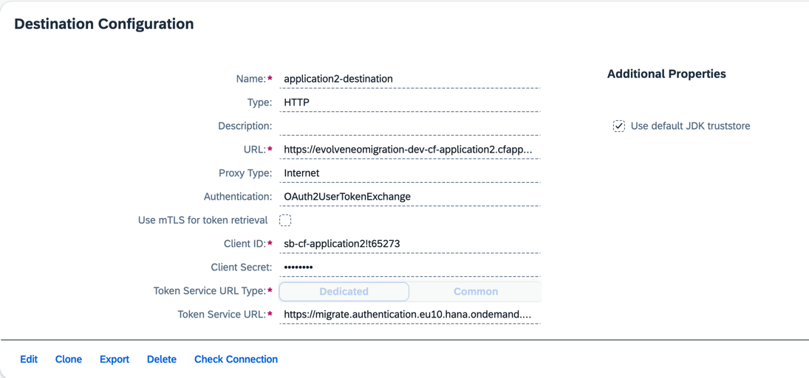

Properties:
- Name: application2-destination
- Type: HTTP
- URL: url of the deployed `migration/application2` (cf-application2 application in SAP BTP CloudFoundry Cockpit)
- Proxy Type: Internet
- Authentication: OAuth2UserTokenExchange
- Client ID: clientid of the deployed `migration/application2` (cf-application2 application)
- Client Secret: clientsecret of the deployed `migration/application2` (cf-application2 application)
- Token Service URL: url of the deployed `migration/application2` (cf-application2 application) + `/oauth/token`

Client ID, Client Secret and Token Service URL can be taken from `cf-app2-xsuaa` service binding. Find it in the Cockpit and click `View Credentials`:
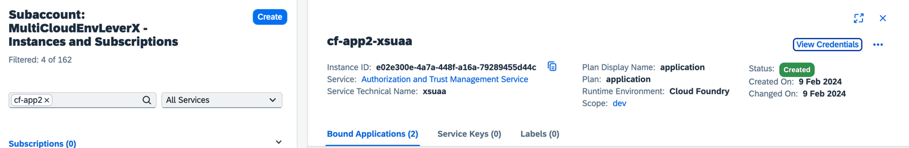

> Important! The Token Service URL is created by adding the XSUAA url and "/oauth/token" part.<br>
> Important! E.g. XSUAA url = https://${some_domain}.hana.ondemand.com<br>
> Important! E.g. Token Service URL = https://${some_domain}.hana.ondemand.com/oauth/token

Useful links:
- [OAuth User Token Exchange Authentication](https://help.sap.com/docs/connectivity/sap-btp-connectivity-cf/oauth-user-token-exchange-authentication)

### Step 9. SAP BTP CF Deployment

#### With mta.yaml

For SAP BTP Cloud Foundry, we can use a **deployment descriptor** to deploy an application.
Create a `mta.yaml` file in the project's root directory. It should be two different `mta.yaml` files: one for `application1` and one for `application2`.<br>
`migration/application1/mta.yaml` example:
```yaml
_schema-version: "3.2"
version: 0.0.1
ID: cf-application1
modules:
  - name: cf-application1
    type: java
    path: ./
    parameters:
      disk-quota: 512MB
      memory: 512MB
    build-parameters:
      buildpack: sap_java_buildpack
      build-result: "target/application1-1.0-SNAPSHOT.war"
    properties:
      ENABLE_SECURITY_JAVA_API_V2: true
      JBP_CONFIG_RESOURCE_CONFIGURATION: [ "tomcat/webapps/ROOT/META-INF/context.xml": { "service_name_for_DefaultDB": "cf-app1-hana" } ]
      SET_LOGGING_LEVEL: 'ROOT: INFO'
    requires:
      - name: cf-app1-destination
      - name: cf-app1-xsuaa
      - name: cf-app1-hana
    provides:
      - name: cf-app1-java-app
        properties:
          java_app_url: '${default-url}'

  - name: cf-application1-approuter
    type: approuter.nodejs
    path: approuter
    parameters:
      disk-quota: 256M
      memory: 256M
    properties:
      XS_APP_LOG_LEVEL: debug
    requires:
      - name: cf-app1-xsuaa
      - name: cf-app1-java-app
        group: destinations
        properties:
          name: cf-app1-destination
          url: '~{java_app_url}'
          forwardAuthToken: true

resources:
  - name: cf-app1-destination
    type: org.cloudfoundry.managed-service
    parameters:
      service: destination
      service-plan: lite
  - name: cf-app1-xsuaa
    type: org.cloudfoundry.managed-service
    parameters:
      service: xsuaa
      service-plan: application
      path: ./xs-security.json
  - name: cf-app1-hana
    type: com.sap.xs.hana-schema
```

<details>
<summary>mta.yaml for migration/application2/mta.yaml</summary>

```yaml
_schema-version: "3.2"
version: 0.0.1
ID: cf-application2
modules:
  - name: cf-application2
    type: java
    path: ./
    parameters:
      disk-quota: 512MB
      memory: 512MB
    build-parameters:
      buildpack: sap_java_buildpack
      build-result: "target/application2-1.0-SNAPSHOT.war"
    properties:
      ENABLE_SECURITY_JAVA_API_V2: true
      SET_LOGGING_LEVEL: 'ROOT: INFO'
    requires:
      - name: cf-app2-xsuaa
      - name: cf-app2-sdm
      - name: cf-app2-destination
      - name: cf-app2-connectivity
    provides:
      - name: cf-app2-java-app
        properties:
          java_app_url: '${default-url}'

  - name: cf-application2-approuter
    type: approuter.nodejs
    path: approuter
    parameters:
      disk-quota: 256M
      memory: 256M
    properties:
      XS_APP_LOG_LEVEL: debug
    requires:
      - name: cf-app2-xsuaa
      - name: cf-app2-java-app
        group: destinations
        properties:
          name: cf-app2-destination
          url: '~{java_app_url}'
          forwardAuthToken: true

resources:
  - name: cf-app2-destination
    type: org.cloudfoundry.managed-service
    parameters:
      service: destination
      service-plan: lite
  - name: cf-app2-connectivity
    type: org.cloudfoundry.managed-service
    parameters:
      service: connectivity
      service-plan: lite
  - name: cf-app2-xsuaa
    type: org.cloudfoundry.managed-service
    parameters:
      service: xsuaa
      service-plan: application
      path: ./xs-security.json
  - name: cf-app2-sdm
    type: org.cloudfoundry.managed-service
    parameters:
      service: sdm
      service-plan: standard
```
</details>

The `modules` section describes applications that will be deployed and the `resources` section describes service instances that will be created.<br>
Each application in the `modules` section has the following details:
- name - name of the application to be deployed
- type - type of the application (nodejs, java etc.)
- path - **relative** path (relative to mta.yaml) to directory which contains the application files
- properties - user-defined environment variables
- requires - specifying resources' name will create a service binding to the deployed application<br>

#### Build and deploy

1. Follow the next steps both for `migration/application1` and `migration/application2` directories. You can do it for `application1` first and for `application2` afterwards.
2. Run `mvn clean package` to build the `*.war` file.
3. Run `cf login --sso` and login to your subaccount and space.
4. Run `mbt build` to generate the `mta_archives/<name_of_mtar_file>.mtar` file that will be used for deployment.
5. Run `cf deploy mta_archives/<name_of_mtar_file>.mtar`.
6. Wait for the deployment and start of the application.
7. Make sure you assign yourself the `Everyone_RC` and `Everyone_RC_app2`  roles from the SAP BTP Cockpit in order to view the applications.

Useful links:
- [Multitarget Applications in the Cloud Foundry environment](https://help.sap.com/docs/btp/sap-business-technology-platform/multitarget-applications-in-cloud-foundry-environment)<br>
- [MTA Deployment Descriptor Syntax](https://help.sap.com/docs/SAP_HANA_PLATFORM/4505d0bdaf4948449b7f7379d24d0f0d/4050fee4c469498ebc31b10f2ae15ff2.html)<br>

#### Build and deploy SAPUI5 application
1. Copy `scenario/cf/employeelistui` to the `migration` folder.
1. Go to the `migration/employeelistui` directory.
2. Run `cf login --sso` and login to your subaccount and space.
3. Make sure [MTA Deployment Descriptor Syntax](./scenario/cf/employeelistui/mta.yaml) has a correct pattern to the cf-application1 app url in resources sections -> javamigrationsample-destination-service->javamagement destination.

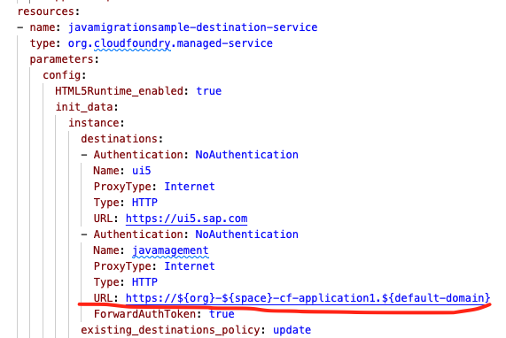

4. Run `mbt build` to generate the `mta_archives/<name_of_mtar_file>.mtar` file that will be used for deployment.
5. Run the `cf deploy mta_archives/<name_of_mtar_file>.mtar`.
6. Open the **HTML5 Applications** menu item in SAP BTP CF cockpit and search for javamigrationsample to open the application.

> Note: You have to subscribe to `SAP Build Workzone standard or advanced service` in order to see the SAP UI5 Application.


### Test the different scenarios

You should be able to test the different scenarios using the HTML5 UI. Open the HTML5 Applications menu item in SAP BTP CF cockpit and search for `javamigrationsample` to open the application. By using the UI you can test the different scenarios all in one by uploading a file, viewing the uploaded file, and deleting the uploaded file. Make sure the image doesn't exceed 2MB.

**Scenarios:**
- **Authentication and authorization:**
   - Navigate to the BTP Cockpit and assign the `Everyone_RC` and `Everyone_RC_app2` roles to your user. After that use the approuter urls to access `application1` and `application2`. You will be prompted to login using an identity provider.
   - Too see the current users info navigate to the `userinfo` endpoint of `application1`.
- **Destination & Connectivity**
   - The connectivity and destination scenario relates to the on-premise scenario. You can test the connection to the on-premise system by navigating to the `/onpremise` endpoint of `application2`. You should see the response from the on-premise hello servlet.
- **Document Management Service (ECM):**
   - You can test the ECM service by navigating to the `/documents` endpoint of `application2` and uploading a photo to the server.
- **Persistency:**
   - Easiest way to test the connection to the database is to upload an image using the SAP UI5 application. The image will be stored in the database. You can see the ids of the stored images if you navigate to the `management` endpoint of `application1`.
    
