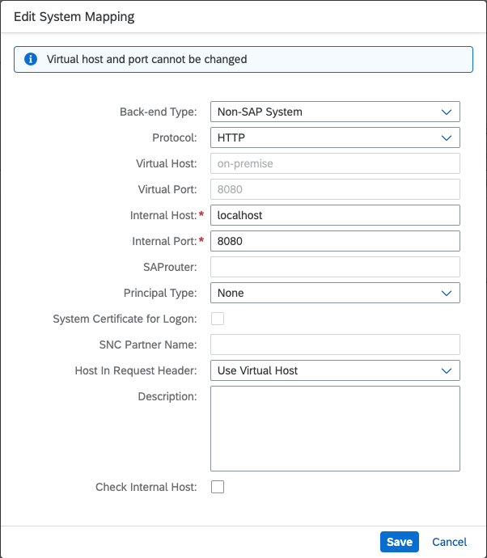

# Running the Refactored Application for Connectivity Usage in the Cloud Foundry Environment
The connectivity sample covers two basic connectivity scenarios:
- [Outbound Internet Connectivity](#outbound-internet-connectivity)
- [Cloud to On-Premise Connectivity](#on-premise-connectivity)

## Deploy the Application

To run the application, you need to deploy it in the Cloud Foundry environment. Deploy it by following these steps:

1. Build the application by executing the following command:
    ```sh
    mvn clean install
    ```

2. Log on to your Cloud Foundry account:
    ```sh
    cf login --sso
    ```

3. Deploy the application in the Cloud Foundry environment:
    ```sh
    cf deploy . -f
    ```

## Create Destination
To run the sample, create a destination in your subaccount. There are two options:
- One option is to create a destination on subaccount level from the SAP BTP cockpit.
- Another option is to create a destination on service instance level using the REST API described on [SAP Business Accelerator Hub](https://api.sap.com/api/SAP_CP_CF_Connectivity_Destination/path/post_instanceDestinations). You can also use the script `create-destination.sh`, which uses that REST API to create a destination on service instance level:
  ```sh
  ./create-destination.sh <app-name> <destination-body>
  ```
  > Note: The script is located in the [/pipelines/scripts](../../../pipelines/scripts/) directory.<br>
  > Note: You can find the `<app-name>` in [`mtad.yaml`](mtad.yaml) file. The `<destination-body>` is different for the different scenarios, so look above to understand how to constuct it.

## Outbound Internet Connectivity
### Destination Configuration
For outbound Internet connectivity, the `<destination-body>` should be `JSON` in the following format:
```json
{
    "Type": "HTTP",
    "Name": "<destination name>",
    "ProxyType": "Internet",
    "URL": "<target URL>",
    "Authentication": "NoAuthentication"
}
```
The `<target URL>` is the endpoint you want to reach. You can assign this JSON to a variable and use it to create the destination:
```sh
destination_body='{
    "Type": "HTTP",
    "Name": "<destination name>",
    "ProxyType": "Internet",
    "URL": "<target URL>",
    "Authentication": "NoAuthentication"
}'
../../../pipelines/scripts/create-destination.sh "<app-name>" "${destination_body}"
```

## On-Premise Connectivity
### On-Premise Application Deployment
To run the on-premise scenario, you have to deploy the on-premise application. There are two ways to deploy the application:
- The first option is to deploy it on a Tomcat 9 local container. To do so:
    1. Install [Apache Tomcat | tomcat.apache.org](https://tomcat.apache.org/).
    2. Copy [`/pipelines/scripts/onpremise/backend-app/backend-app.war`](../../../pipelines/scripts/onpremise/backend-app/backend-app.war) to the `webapps` directory of the installed Tomcat container.
    3. To run the container, execute the script `startup.sh` located in the `bin` directory.
- The second option is to run a Docker container with Tomcat 9. To do so:
    1. Navigate to [`/pipelines/scripts/onpremise/backend-app`](../../../pipelines/scripts/onpremise/backend-app/).
    2. Run the following commands:
        ```sh
        docker buildx build -t backend-app .
        docker run -d -p 8080:8080 backend-app
        ```

    3. The application should be accessible on `http://localhost:8080/backend-app/noauth`.

### Cloud Connector Configuration
1. Download the appropriate version of the Cloud Connector for your machine from [SAP Development Tools](https://tools.hana.ondemand.com/#cloud).
2. Extract the downloaded ZIP file and run the `./go.sh` script. In the console, there will be a link from which you can access the Cloud Connector from the browser.
3. Log on to the Cloud Connector.
  - Enter `Administrator` for username.
  - Enter `manage` for password.
    > Note: When you are logged in, you will be prompted to change the password.
4. From the main page, choose `Add Subaccount > Configure Manually > Enter Subaccount Data > Finish` to connect the Cloud Connector to your SAP BTP subaccount.
  - `Region`: You can select one from the list, or enter the region host of your subaccount if it is missing in the list.
  - `Subaccount`: Enter the SubaccountID.
  - `Subaccount User`: Enter the email address of the user.
  - `Password`: Enter the user's password.
5. In the `Cloud to On-Premise` tab, create a system mapping to your local application. To do that:

    5.1 Select `Non-SAP System` for the `Back-end type`.

    5.2 Select `HTTP` for `Protocol`.
    
    5.3 Enter `localhost` for `Internal Host`. This is the host on which the Cloud Connector can access the on-premise application.
    
    5.4 Enter `"8080"` for `Internal Port`. This is the port on which the Cloud Connector can access the on-premise application.
    
    5.5 The `Virtual Host` is the host on which the cloud application can access the on-premise application. You can use `on-premise` as a value.
    
    5.6 The `Virtual Port` is the port on which the cloud application can access the on-premise application. You can use `8080` as a value.
    
    5.7 Unselect `Allow Principal Propagation`.
    
    5.8 Select `Use Virtual Host` for `Host In Request Header`.
    
    The system mapping sould look like this:

    

6. In the `Cloud to On-Premise` tab, create a resource.

    6.1 Select `/` for `URL Path`.
    
    6.2 Select `Path And All Sub-Paths` for `Access Policy`.

### Destination Configuration
For on-premise connectivity, the `<destination-body>` should be a JSON in the following format:
```json
{
    "Type": "HTTP",
    "Name": "<destination name>",
    "ProxyType": "OnPremise",
    "URL": "http://<virtual-host>:<virtual-port>/backend-app/noauth",
    "Authentication": "NoAuthentication"
}
```
`URL` is the endpoint of your on-premise application. If you use the suggested virtual host and port, the `URL` should be `http://on-premise:8080/backend-app/noauth`.<br>
You can assign this JSON to a variable and use it to create the destination:
```sh
destination_body='{
    "Type": "HTTP",
    "Name": "<destination name>",
    "ProxyType": "OnPremise",
    "URL": "http://on-premise:8080/backend-app/noauth",
    "Authentication": "NoAuthentication"
}'
../../../pipelines/scripts/create-destination.sh "<app-name>" "${destination_body}"
```

## Access the Application
When the destinations are created, restart the cloud application. You can do it either from the SAP BTP cockpit, or by executing `cf restart <app-name>`.

To test the application in a browser:

1. Open the application URL from the **Overview** page of the application in the SAP BTP cockpit.
2. Pass the query parameter `destname`.

    The URL should look like this: `https://<app-name>.cfapps.<cf-app-domain>?destname=<destination-name>`.